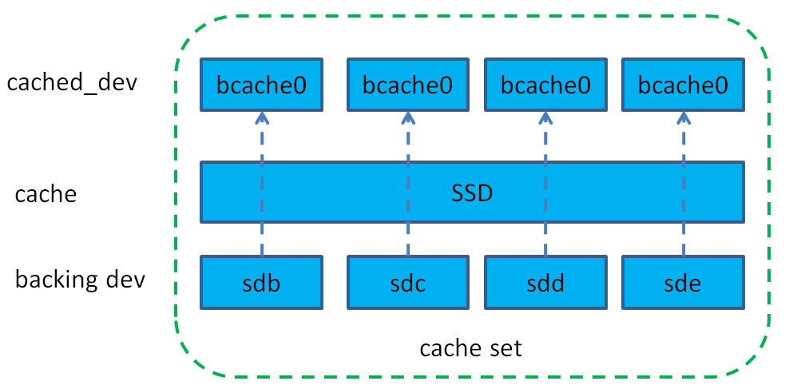
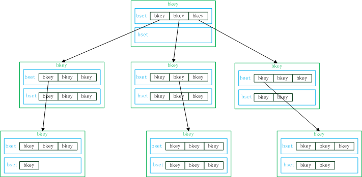
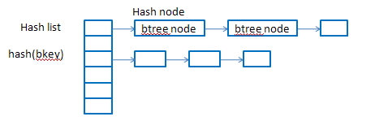
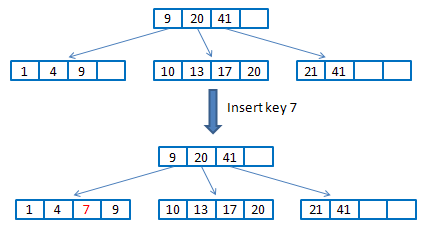
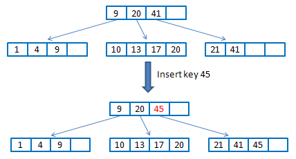
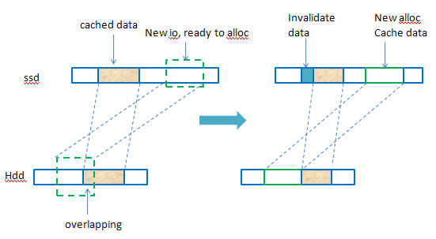
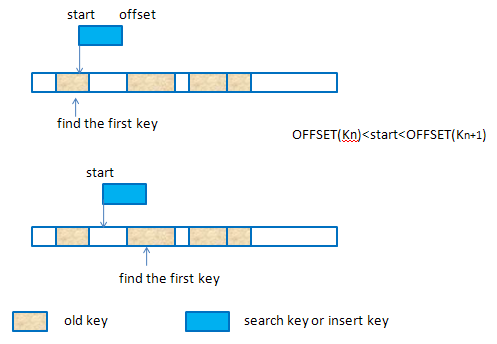
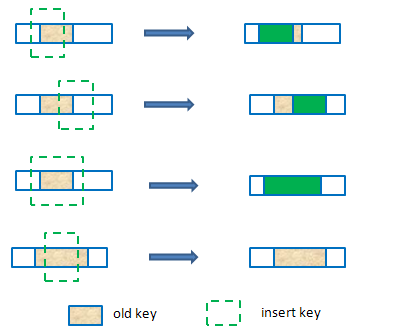
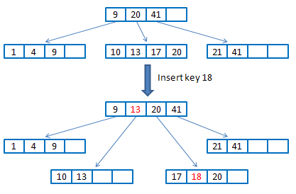

# 1.简介
bcache是linux内核块设备层cache，类似于flashcache使用ssd作为hdd的缓存方案，相比于flashcache，bcache更加灵活，支持ssd作为多块hdd的共享缓存，并且还支持多块ssd（还未完善），能够在运行中动态增加，删除缓存设备和后端设备。从3.10开始，bcache进入内核主线。bcache支持writeback、writethrough、writearoud三种策略，默认是wriththrough，可以动态修改，缓存替换方式支持lru、fifo和random三种。下面从几个方面介绍bcache的实现机制。
# 2.总体结构
bcache的整体结构如图所示。

bcache中是以cache set来划分不同存储集合，一个cache set中包含一个或多个缓存设备（一般是ssd），一个或多个后端设备（一般是hdd）。bcache对外输出给用户使用的是/dev/bcache<N>这种设备，每个bcache<N>设备都与一个后端物理盘一一对应。用户对不同bcache设备的io会缓存在ssd中，刷脏数据的时候就会写到各自对应的后端设备上。因此，bcache扩容很容易，只要注册一个新的物理设备即可。
<!--more-->
# 3.bcache关键结构
## 3.1 bucket
缓存设备会按照bucket大小划分成很多bucket，bucket的大小最好是设置成与缓存设备ssd的擦除大小一致，一般建议128k~2M+，默认是512k。每个bucket有个优先级编号（16 bit的priority），每次hit都会增加，然后所有的bucket的优先级编号都会周期性地减少，不常用的会被回收，这个优先级编号主要是用来实现lru替换的。bucket还有8bit的generation，用来invalidate bucket用的。
bucket内空间是追加分配的，只记录当前分配到哪个偏移了，下一次分配的时候从当前记录位置往后分配。另外在选择bucket来缓存数据时有两个优先原则：1）优先考虑io连续性，即使io可能来自于不同的生产者；2）其次考虑相关性，同一个进程产生的数据尽量缓存到相同的bucket里。
## 3.2 bkey
bucket的管理是使用b+树索引，而b+树节点中的关键结构就是bkey，bkey就是记录缓存设备缓存数据和后端设备数据的映射关系的，其结构如下。
```cpp
struct bkey {
 uint64_t	high;
 uint64_t	low;
 uint64_t	ptr[];
}
```

其中：
* KEY_INODE:表示一个后端设备的id编号（后端设备在cache set中一般以bdev0，bdev1这种方式出现）
* KEY_SIZE：表示该bkey所对应缓存数据的大小
* KEY_DIRTY：表示该块缓存数据是否是脏数据
* KEY_PTRS：表示cache设备的个数（多个ptr是用来支持多个cache设备的，多个cache设备只对脏数据和元数据做镜像）
* KEY_OFFSET：bkey所缓存的hdd上的那段数据区域的结束地址
* PTR_DEV：cache设备
* PTR_OFFSET：在缓存设备中缓存的数据的起始地址
* PTR_GEN：对应cache的bucket的迭代数（版本）
## 3.3 bset
一个bset是一个bkey的数组，在内存中的bset是一段连续的内存，并且以bkey排序的（bkey之间进行比较的时候是先比较KEY_INODE，如果KEY_INODE相同，再比较KEY_OFFSET）。
bset在磁盘上（缓存设备）有很多，但是内存中一个btree node只有4个bset。
# 4. bcache中的b+树
## 4.1 btree结构
bcache中以b+tree来维护索引，一个btree node里包含4个bset，每个bset中是排序的bkey。

图中做了简化，一个btree node只画了两个bset。
每个btree node以一个bkey来标识，该bkey是其子节点中所有bkey中的最大值，不同于标准的b+树那样，父节点存放子节点的地址指针，bcache中的b+树中非叶子节点中存放的bkey用于查找其子节点（并不是存的地址指针），而是根据bkey计算hash，再到hash表中取查找btree node。叶子节点中的bkey存放的就是实际的映射了（根据这些key可以找到缓存数据以及在hdd上的位置）。

bkey插入到b+树中的过程与标准的b+树的插入过程类似，这里不做细讲。


## 4.2 btree插入bkey时overlapping的处理
收到新的写io时，这个io对应hdd上的数据可能有部分已经缓存在ssd上了，这个时候为这个io创建的bkey就需要处理这种overlapping的问题。
Btree node 是log structured，磁盘上的btree node有可能有overlap的情况，因为是在不同时候写入的。但是内存中的btree node不会有overlap，因为插入bkey时如果和内存中的bkey有overlap，就会解决overlap的问题；另外，从磁盘上读出btree node时就会把bsets中的bkey做归并排序，就会检查overlap的问题并进行解决。
下图给出了一个示例情况。

出现这种overlapping的情况，原来的bkey会做修改（ssd和hdd上的偏移都会修改，还有数据大小）。

插入key或者查找key时，使用待处理的key的start来遍历bset中的bkey（bset中的bkey排序了），找到可能存在overlapping的第一个key，如下图描述的两种情况。

要处理的overlapping情况有以下几种：

读数据的时候也有可能出现这种部分命中，部分miss的情况，本质上和插入key处理overlapping的一样，只不过命中的部分从cache设备中读，miss的部分是从hdd读，并且会重新插入一个新的key来缓存这部分miss的数据。
## 4.3 btree node split
b+树节点有最大大小限制，在新创建一个btree node时就在内存中分配了一段连续的空间来存放bset及bkey（按照指定的内存pages数），如果超过这个pages数，btree node就会分裂。
在进行key的插入时，递归进行插入，到叶子节点上如果需要分裂，则会以3/5节点大小分裂成2个节点，把分裂成的两个节点的最大key通过op传到上层函数调用中，叶子节点这层函数退出后，在上一层的函数里就会把op中的key添加到keys中（这样就修改了父节点的指针），如果这一层还需要分裂，跟之前的分裂过程一致，分裂后的节点都会立即持久化到ssd中。

# 5. writeback
bcache支持三种缓存策略：writeback，writethrough，writearoud。writethrough就是既写ssd也写hdd，这样读的时候如果命中的话就可以从ssd中读，适应于读多写少的场景；writearoud就是绕过ssd直接读写hdd，个人感觉这种方式没啥意义；writeback就是ssd做写缓存，所有的写入都是先写缓存，然后会在后台刷脏数据，这里主要介绍writeback。

上文提到bucket内是以追加的方式来分配空间的，一个bucket里面缓存的数据可能对应hdd上的不同位置，甚至有可能在不同的hdd。不同于flashcache以set为单位刷脏数据（等同于bcache中的bucket），bcache中以bkey为单位来writeback，而不是以bucket为单位。每个cache set都有一个writeback_keys，记录需要writeback的bkeys。当满足刷脏数据的条件时（脏数据比例），就会遍历整个b+树，查找dirty的bkey，放到writeback_keys中（writeback_keys有个大小限制），然后按照磁盘偏移排序，再进行刷脏数据的动作，数据写到hdd后，会把对应的bkey从writeback_keys移除，并去掉该bkey的dirty标记。这样的好处在于刷脏数据的时候可以尽量考虑hdd上的连续性，减少磁头的移动，而如果以bucket为单位刷，一个bucket可能缓存hdd上不同位置的数据，比较随机，刷脏数据的效率不高。

既然bucket内的空间分配是按照追加的方式，每次都是从后面开发分配，而刷脏数据又不是以bucket为单位，那么就会出现bucket中有空洞的情况（bucket中间有些数据已经刷到磁盘上了），导致bucket已用空间不多，但是很多空闲空间比较分散，从后面分配又空间不足。对于这种情况，bcache中又专门的垃圾回收机制（gc），会把这种情况的bucket给回收掉，从而可以重新使用这个bucket。

writeback方式虽然性能比较高，但是会出现意外宕机情况下的恢复问题。对于这种情况，bcache能够很好地处理。在引入journal之前（后面会介绍），在数据写入到缓存ssd中后，io并没有返回，而是等到相应的btree node也持久化后，再返回写成功，这样意味着每次写io都会写元数据，宕机的情况下就能够根据元数据恢复出来，不过这种方式就导致每次都要写元数据，而元数据的io都比较小，对于ssd来说，小io有写放大的问题，导致了效率低下。引入journal后，就解决了这个性能问题。

# 6. journal
journal不是为了一致性恢复用的，而是为了提高性能。在writeback一节提到没有journal之前每次写操作都会更新元数据（一个bset），为了减少这个开销，引入journal，journal就是插入的keys的log，按照插入时间排序，只用记录叶子节点上bkey的更新，非叶子节点在分裂的时候就已经持久化了。这样每次写操作在数据写入后就只用记录一下log，在崩溃恢复的时候就可以根据这个log重新插入key。

# 7. garbage colletction
gc的目的是为了重用buckets。初始化cache时会在bch_moving_init_cache_set中会初始化一个判断bkey是否可以gc的函数moving_pred，该函数就是判断该key所对应的bucket的GC_SECTORS_USED是否小于cache->gc_move_threshold，如果是则可以gc，否则不能。

gc一般是由invalidate buckets触发的。bcache使用一个moving_gc_keys（key buf，以红黑树来维护）来存放可以gc的keys，gc时会扫描整个btree，判断哪些bkey是可以gc的，把能够gc的bkey加到moving_gc_keys中，然后就根据这个可以gc的key先从ssd中读出数据，然后同样根据key中记录的hdd上的偏移写到hdd中，成功后把该key从moving_gc_keys中移除。

# 8.总结
bcache相对于flashcache要复杂很多，使用b+树来维护索引就可见一斑。虽然bcache已经进入了内核主线，但是目前使用bcache的人还是比较少的，离商用还有一段距离。bcache还不太稳定，时不时有些bug出现，而且其稳定性需要比较长的时间来检测。而flashcache来说就稳定很多，而且有facebook作为其最大的维护者，国内外还有很多公司也在使用，成熟度是公认的。