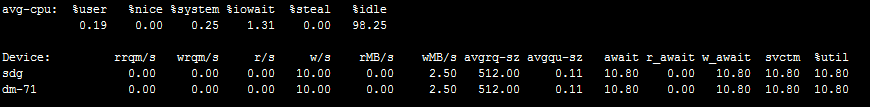
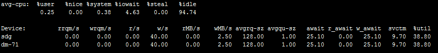
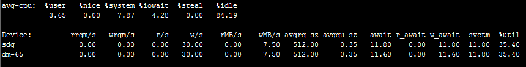
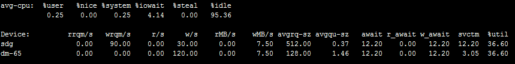
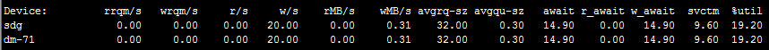
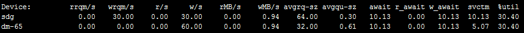
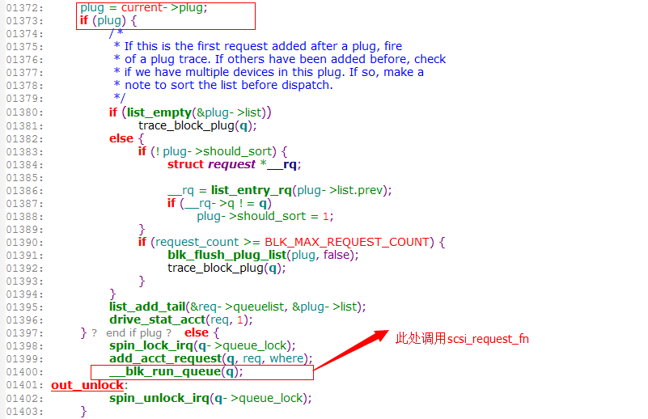
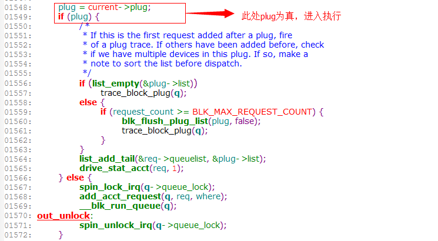
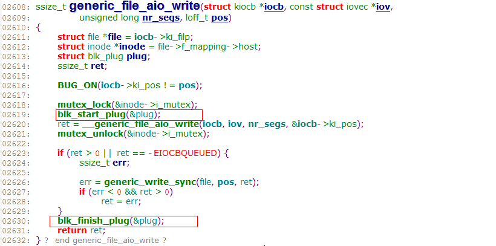
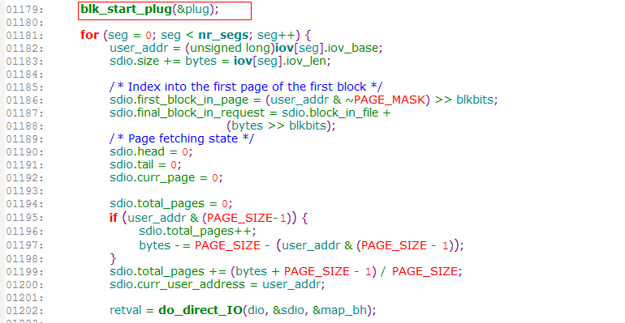

在上一篇《块设备内核参数max_segments和max_sectors_kb解析》介绍了max_sectors_kb这个参数对device mapper设备和软raid设备的影响，实际在测试时，发现另外一个奇怪的现象：一块物理盘，在这个盘上创建一个device mapper设备，然后对这个设备使用direct IO进行随机大块写或者顺序大块写（随机读和顺序读没这个问题），块大小要大于dm设备的max_sectors_kb，但是小于dm底层设备（这里是物理磁盘）的max_sectors_kb，测试结果发现在3.2内核里落到物理盘上的io并没有合并，但是在3.10内核下落到物理盘上的io确是合并了（合并后的大小为用户发的io块大小）。具体现象下面以例子进行说明。

# 1.不同内核下的表现
这里选取3.2.57内核和3.10.11内核作为对比。
## 1.1  3.2.57内核下测试
物理盘sdg，在其上创建的10G的device mapper设备dmtest1，对应的设备为dm-71
1）默认的参数设置
```bash
# cat /sys/block/sdg/queue/max_sectors_kb
512
# cat /sys/block/sdg/queue/max_segments
128
# cat /sys/block/dm-71/queue/max_sectors_kb
512
# cat /sys/block/dm-71/queue/max_segments
128
```

<!--more-->
使用fio测试，配置如下
```bash
[global]
rw=randwrite
direct=1
numjobs=1
ioengine=sync
bsrange=256k-256k
rate_iops=10
runtime=120
group_reporting
[disk00]
filename=/dev/dm-71
```

然后iostat查看io状态

可以看到dm设备和sdg上的io大小都是256KB。

2）修改dm设备max_sectors_kb参数
```bash
# echo 64 > /sys/block/dm-71/queue/max_sectors_kb 
```
同样使用fio测试，iostat查看

只调整了dm设备的max_sectors_kb参数，没有调整物理设备的（还是512），期望的结果是dm设备上平均io大小是64kb，然后物理设备上市256kb，但是结果落到物理设备上的io并没有合并。

## 1.2  3.10.11内核下测试
物理盘sdg，在其上创建的10G的device mapper设备dmtest1，对应的设备为dm-65
1）默认的参数设置
```bash
# cat /sys/block/sdg/queue/max_sectors_kb
512
# cat /sys/block/sdg/queue/max_segments
128
# cat /sys/block/dm-65/queue/max_sectors_kb
512
# cat /sys/block/dm-65/queue/max_segments
128
```
fio测试是和上面配置一样，
iostat查看io情况如下


2）修改dm设备max_sectors_kb参数
```bash
# echo 64 > /sys/block/dm-65/queue/max_sectors_kb 
```
同样的fio测试，iostat结果

结果dm设备上io变成64KB，而最后落到物理设备上确是合并后的结果，也就是用户发的256KB。跟期望的结果一致。
那么在这两个内核下到底是什么地方导致了结果的不同呢？

# 2.使用systemtap分析
首先简单介绍一下direct io时的io调用路径，这里以write为例。
```cpp
sys_write系统调用  -->  vfs_write() --> do_sync_write() --> blkdev_aio_write() --> __generic_file_aio_write() --> generic_file_direct_write() --> blkdev_direct_IO() --> __blockdev_direct_IO()  -->  dio_bio_submit()  ->  submit_bio()  --> generic_make_request() --> 会调用q->make_request_fn()  --> blk_queue_bio()，在初始化scsi磁盘时注册的，这个函数处理io合并的（包含各个调度算法的调用）  -->  最后会触发调用scsi_request_fn()，这个也是在初始化scsi磁盘的时候注册的，有多个地方触发scsi_request_fn  --> scsi_dispatch_cmd下发到底层设备
```
然后使用systemtap在关键函数调用处探测，为了方便统计，fio块大小设置为32KB，device mapper的max_sectors_kb设置为16。

## 2.1  3.2.57内核下分析
```bash
# echo 16 > /sys/block/dm-71/queue/max_sectors_kb
```

stap结果
```bash
[generic_file_direct_write] size:32768
[__blockdev_direct_IO] nr_segs:1, iov:{.iov_base=0x17ad000, .iov_len=32768}
[submit_page_section] bi_sector:11221952, size:4096
[dio_send_cur_page] bi_sector:11221952, size:4096
[submit_page_section] bi_sector:11221952, size:8192
[dio_send_cur_page] bi_sector:11221952, size:8192
[submit_page_section] bi_sector:11221952, size:12288
[dio_send_cur_page] bi_sector:11221952, size:12288
[submit_page_section] bi_sector:11221952, size:16384
[dio_send_cur_page] bi_sector:11221952, size:16384
[dio_bio_submit] bi_sector:11221952, size:16384
[submit_bio] bi_sector:11221952, size:16384
[blk_queue_bio] bi_sector:179006400, size:16384
[scsi_request_fn] id:6, lun:0, channel:0
[submit_page_section] bi_sector:11221984, size:4096
[dio_send_cur_page] bi_sector:11221984, size:4096
[submit_page_section] bi_sector:11221984, size:8192
[dio_send_cur_page] bi_sector:11221984, size:8192
[dio_send_cur_page] bi_sector:11221984, size:12288
[dio_bio_submit] bi_sector:11221984, size:16384
[submit_bio] bi_sector:11221984, size:16384
[blk_queue_bio] bi_sector:179006432, size:16384
[scsi_request_fn] id:6, lun:0, channel:0
[scsi_request_fn] id:6, lun:0, channel:0
[scsi_request_fn] id:6, lun:0, channel:0
[scsi_request_fn] id:6, lun:0, channel:0
[__generic_file_aio_write] nr_segs:1, iov:{.iov_base=0x17ad000, .iov_len=32768}
[generic_file_direct_write] size:32768
[__blockdev_direct_IO] nr_segs:1, iov:{.iov_base=0x17ad000, .iov_len=32768}
```

可以看到在调用blk_queue_bio之后就立即调用了scsi_request_fn
把scsi_request_fn的函数调用栈打印出来，可以看到确实是由blk_queue_bio触发的scsi_request_fn。
```bash
 0xffffffffa000798a : scsi_request_fn+0x35/0x51e [scsi_mod]
 0xffffffff8119ac61 : blk_queue_bio+0x26f/0x28a [kernel]
 0xffffffff8119969e : generic_make_request+0x90/0xcf [kernel]
 0xffffffff811997b0 : submit_bio+0xd3/0xf1 [kernel]
 0xffffffff811238a0 : dio_bio_submit+0x6e/0x8d [kernel]
 0xffffffff811246f8 : __blockdev_direct_IO+0x8ee/0xa67 [kernel]
 0xffffffff8112250e : blkdev_direct_IO+0x4e/0x53 [kernel]
 0xffffffff810b5ed8 : generic_file_direct_write+0xdc/0x14c [kernel]
 0xffffffff810b60dc : __generic_file_aio_write+0x194/0x278 [kernel]
 0xffffffff81122825 : blkdev_aio_write+0x1f/0x61 [kernel]
 0xffffffff810fa560 : do_sync_write+0xb4/0xec [kernel]
 0xffffffff810fac51 : vfs_write+0xa2/0xe9 [kernel]
 0xffffffff810fae2e : sys_write+0x45/0x6b [kernel]
 0xffffffff81354a12 : system_call_fastpath+0x16/0x1b [kernel]
 ```
为了对比，下面看看3.10.11内核下的stap结果。
```bash
===========================
[scsi_request_fn] id:6, lun:0, channel:0
 0xffffffffa000798a : scsi_request_fn+0x35/0x51e [scsi_mod]
 0xffffffff81197599 : blk_run_queue+0x1d/0x2f [kernel]
 0xffffffffa0006abd : scsi_run_queue+0x1c5/0x241 [scsi_mod]
 0xffffffffa000850a : scsi_next_command+0x2d/0x39 [scsi_mod]
 0xffffffffa00089a7 : scsi_io_completion+0x450/0x4ca [scsi_mod]
 0xffffffff8119dcd4 : blk_done_softirq+0x65/0x74 [kernel]
 0xffffffff8104c36e : __do_softirq+0xb9/0x177 [kernel]
 0xffffffff81356c6c : call_softirq+0x1c/0x30 [kernel]
 0xffffffff8100fa21 : do_softirq+0x3c/0x7b [kernel]
 0xffffffff8104c5d6 : irq_exit+0x3c/0x99 [kernel]
 0xffffffff813566de : call_function_single_interrupt+0x6e/0x80 [kernel]
===========================
[scsi_request_fn] id:6, lun:0, channel:0
 0xffffffffa000798a : scsi_request_fn+0x35/0x51e [scsi_mod]
 0xffffffff81197599 : blk_run_queue+0x1d/0x2f [kernel]
 0xffffffffa0006abd : scsi_run_queue+0x1c5/0x241 [scsi_mod]
 0xffffffffa000850a : scsi_next_command+0x2d/0x39 [scsi_mod]
 0xffffffffa00089a7 : scsi_io_completion+0x450/0x4ca [scsi_mod]
 0xffffffff8119dcd4 : blk_done_softirq+0x65/0x74 [kernel]
 0xffffffff8104c36e : __do_softirq+0xb9/0x177 [kernel]
 0xffffffff81356c6c : call_softirq+0x1c/0x30 [kernel]
 0xffffffff8100fa21 : do_softirq+0x3c/0x7b [kernel]
 0xffffffff8104c5d6 : irq_exit+0x3c/0x99 [kernel]
 0xffffffff813566de : call_function_single_interrupt+0x6e/0x80 [kernel]
===========================
[scsi_request_fn] id:6, lun:0, channel:0
 0xffffffffa000798a : scsi_request_fn+0x35/0x51e [scsi_mod]
 0xffffffff811a58c6 : cfq_kick_queue+0x25/0x34 [kernel]
 0xffffffff8105b5cf : process_one_work+0x161/0x269 [kernel]
 0xffffffff8105c598 : worker_thread+0xc2/0x145 [kernel]
 0xffffffff8105f6d9 : kthread+0x76/0x7e [kernel]
 0xffffffff81356b74 : kernel_thread_helper+0x4/0x10 [kernel]
 0xffffffff8105f663 : kthread+0x0/0x7e [kernel] (inexact)
 0xffffffff81356b70 : kernel_thread_helper+0x0/0x10 [kernel] (inexact)
===========================
```
## 2.2  3.10.11内核下分析
```bash
# echo 16 > /sys/block/dm-65/queue/max_sectors_kb
```

stap结果
```bash
[generic_file_direct_write] size:32768
[__blockdev_direct_IO] nr_segs:1, iov:{.iov_base=0x1753000, .iov_len=32768}
[submit_page_section] size:4096
[dio_send_cur_page] size:4096
[submit_page_section] size:8192
[dio_send_cur_page] size:8192
[submit_page_section] size:12288
[dio_send_cur_page] size:12288
[submit_page_section] size:16384
[dio_send_cur_page] size:16384
[dio_bio_submit] size:16384
[submit_bio] size:16384
[blk_queue_bio] bi_sector:175962944, size:16384
[submit_page_section] size:4096
[dio_send_cur_page] size:4096
[submit_page_section] size:8192
[dio_send_cur_page] size:8192
[dio_send_cur_page] size:12288
[dio_bio_submit] size:16384
[submit_bio] size:16384
[blk_queue_bio] bi_sector:175962976, size:16384
[scsi_request_fn] id:6, lun:0, channel:0
[scsi_request_fn] id:6, lun:0, channel:0
[scsi_request_fn] id:6, lun:0, channel:0
[generic_file_direct_write] size:32768
[__blockdev_direct_IO] nr_segs:1, iov:{.iov_base=0x1753000, .iov_len=32768}
```
可以看到第一次blk_queue_bio后（也就是刚好16kb时）并没有立即调用scsi_request_fn，而是在第二次（也就是第二个16kb，合并起来就是用户发的32kb）blk_queue_bio之后再触发的scsi_request_fn，而且下面列出scsi_request_fn的函数调用栈，可以看出并不是blk_queue_bio触发的scsi_request_fn。
```bash
 0xffffffffa00070b6 : scsi_request_fn+0x39/0x4f4 [scsi_mod]
 0xffffffff811b21c3 : __blk_run_queue_uncond+0x1e/0x26 [kernel]
 0xffffffff811b229c : queue_unplugged+0x54/0x78 [kernel]
 0xffffffff811b2de1 : blk_flush_plug_list+0x1b1/0x1c8 [kernel]
 0xffffffff81395748 : io_schedule+0x41/0x6c [kernel]
 0xffffffff8113bbb6 : do_blockdev_direct_IO+0xa14/0xae8 [kernel]
 0xffffffff81138fac : blkdev_direct_IO+0x4e/0x53 [kernel]
 0xffffffff810c645e : generic_file_direct_write+0xe3/0x14a [kernel]
 0xffffffff810c65e0 : __generic_file_aio_write+0x11b/0x1ff [kernel]
 0xffffffff811394db : blkdev_aio_write+0x44/0x93 [kernel]
 0xffffffff811100bf : do_sync_write+0x55/0x7c [kernel]
 0xffffffff81110abc : vfs_write+0x9d/0x103 [kernel]
 0xffffffff81110dae : sys_write+0x51/0x80 [kernel]
 0xffffffff8139b529 : system_call_fastpath+0x16/0x1b [kernel]
 
==========================
[scsi_request_fn] id:6, lun:0, channel:0
 0xffffffffa00070b6 : scsi_request_fn+0x39/0x4f4 [scsi_mod]
 0xffffffff811b21c3 : __blk_run_queue_uncond+0x1e/0x26 [kernel]
 0xffffffff811b260f : blk_run_queue+0x1d/0x2f [kernel]
 0xffffffffa0006f08 : scsi_run_queue+0x1c3/0x249 [scsi_mod]
 0xffffffffa0007e88 : scsi_next_command+0x2d/0x39 [scsi_mod]
 0xffffffffa00082f0 : scsi_io_completion+0x41b/0x48a [scsi_mod]
 0xffffffff811b697d : blk_done_softirq+0x65/0x74 [kernel]
 0xffffffff8104262a : __do_softirq+0xec/0x209 [kernel]
 0xffffffff81042812 : irq_exit+0x3f/0x83 [kernel]
 0xffffffff8139c39d : call_function_single_interrupt+0x6d/0x80 [kernel]
==========================
[scsi_request_fn] id:6, lun:0, channel:0
 0xffffffffa00070b6 : scsi_request_fn+0x39/0x4f4 [scsi_mod]
 0xffffffff811b21c3 : __blk_run_queue_uncond+0x1e/0x26 [kernel]
 0xffffffff811c4ffa : cfq_kick_queue+0x25/0x34 [kernel]
 0xffffffff81053638 : process_one_work+0x191/0x294 [kernel]
 0xffffffff81053aea : worker_thread+0x121/0x1e7 [kernel]
 0xffffffff81057fd9 : kthread+0x81/0x89 [kernel]
 0xffffffff8139b47c : ret_from_fork+0x7c/0xb0 [kernel]
 ```
# 3.分析blk_queue_bio代码
从上面的分析看出问题出在blk_queue_bio这个函数，下面就看看差别在哪。
**3.2.57内核中blk_queue_bio**


**3.10.11内核中blk_queue_bio**


可以看到跟plug=current->plug这个有关，plug是blk_plug结构。
blk_plug允许构建一个缓存碎片IO的请求队列，能够保持io碎片一段时间，这样就能将顺序请求合并成一个大的请求。 合并后请求批量从per-task链表移动到设备请求队列，减少了设备请求队列锁竞争， 从而提高了效率。 
blk_plug的使用很简单：
a）设置该线程开启请求合并模式 blk_start_plug
b）关闭线程请求合并 blk_finish_plug
那么上面描述的问题会不会与blk_start_plug()有关呢？

**3.2.57内核中**在generic_file_aio_write和generic_file_aio_read中都有调用blk_start_plug()

实际上在测试时的io不是由generic_file_aio_write去调用__generic_file_aio_write的，而是在blkdev_aio_write中调用的，
这条io路径的调用函数栈如下，在**这条路径上并没有调用blk_start_plug，所以blk_queue_bio中就没有进入if (plug)的条件语句中**。
```bash
0xffffffff811993d2 : generic_make_request+0x90/0xcf [kernel]
 0xffffffff811994e4 : submit_bio+0xd3/0xf1 [kernel]
 0xffffffff811236a4 : dio_bio_submit+0x6e/0x8d [kernel]
 0xffffffff8112399d : dio_send_cur_page+0x79/0xa4 [kernel]
 0xffffffff81123a6b : submit_page_section+0xa3/0xf8 [kernel]
 0xffffffff8112435f : __blockdev_direct_IO+0x751/0xa67 [kernel]
 0xffffffff81122312 : blkdev_direct_IO+0x4e/0x53 [kernel]
 0xffffffff810b5e1c : generic_file_direct_write+0xdc/0x14c [kernel]
 0xffffffff810b6020 : __generic_file_aio_write+0x194/0x278 [kernel]
 0xffffffff81122629 : blkdev_aio_write+0x1f/0x61 [kernel]
 0xffffffff810fa378 : do_sync_write+0xb4/0xec [kernel]
 0xffffffff810faa69 : vfs_write+0xa2/0xe9 [kernel]
 0xffffffff810fac46 : sys_write+0x45/0x6b [kernel]
 0xffffffff81354d92 : system_call_fastpath+0x16/0x1b [kernel]
```

而**3.10.11内核**中在generic_file_aio_write和generic_file_aio_read中都没有调用这个start plug的函数了，
而是在do_blockdev_direct_IO函数中调用的。

打印blk_start_plug的函数栈，可见确实是在do_blockdev_direct_IO中调用的。
```bash
 0xffffffff811ae2a6 : blk_start_plug+0x1d/0x3b [kernel]
 0xffffffff8113b4e2 : do_blockdev_direct_IO+0x340/0xae8 [kernel]
 0xffffffff81138fac : blkdev_direct_IO+0x4e/0x53 [kernel]
 0xffffffff810c645e : generic_file_direct_write+0xe3/0x14a [kernel]
 0xffffffff810c65e0 : __generic_file_aio_write+0x11b/0x1ff [kernel]
 0xffffffff811394db : blkdev_aio_write+0x44/0x93 [kernel]
 0xffffffff811100bf : do_sync_write+0x55/0x7c [kernel]
 0xffffffff81110abc : vfs_write+0x9d/0x103 [kernel]
 0xffffffff81110dae : sys_write+0x51/0x80 [kernel]
 0xffffffff8139b529 : system_call_fastpath+0x16/0x1b [kernel]
```

# 4.内核patch变更
后来google了一下，从3.6-rc3版本就修复了这个问题，把blk_start_plug从generic_file_aio_write和generic_file_aio_read中移到了do_blockdev_direct_IO。
对应的patch“block: remove plugging at buffered write time” http://www.kernelhub.org/?p=2&msg=16336
关于这个patch的讨论参见 http://www.linuxhorizon.com/9-linux/aae0da2b1c65f3ef.htm#.U3ofDvmSzNd

# 5.结论
从上面的分析得出，blk_plug对io的合并会有影响，在使用device mapper或者软raid时，如果内核低于3.6，就会出现上面描述的问题：上层设备的max_sectors_kb影响了底层设备的io合并。所以建议在条件允许的情况下换成相对较新的内核使用。


