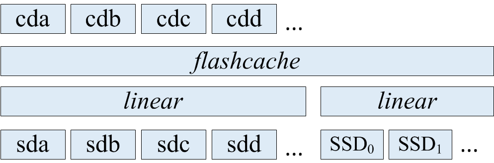

# 简介
flashcachegroup能够使用一块或多块ssd来缓存一组hdd硬盘，硬盘组能够动态增加删除硬盘，ssd缓存能够整个硬盘组而不仅仅是一块硬盘。
其结构如下，参考官方说明https://github.com/lihuiba/flashcachegroup，这里借用介绍里的结构图.

# 1.安装使用flashcachegroup
## 1） 安装flashcache
首先需要安装flashcache，这里使用源码安装
```bash
#git clone https://github.com/facebook/flashcache.git
#cd flashcache
```
切换到稳定版stable_v3.1.1
```bash
#git checkout stable_v3.1.1
```
flashcache编译需要依赖KERNE_TREE
```bash
#make KERNEL_TREE=/usr/src/linux-headers-3.10.11-openstack-amd64/
#make install
```
加载flashcache模块
```bash
#modprobe flashcache
#lsmod | grep flashcache 
```
<!--more-->
## 2）下载fcg
```bash
#git clone https://github.com/lihuiba/flashcachegroup.git
```
然后进入目录,切换到v0.3.0版本
```bash
#git checkout v0.3.0
```
然后执行python setup.py install
如果报错“ImportError: No module named setuptools”，说明缺少python-setuptools
```bash
#apt-get install python-setuptools
```
然后再执行
```bash
#python setup.py install
```
安装成功。
## 3）缺少pydm
使用fcg create报错
“ImportError: No module named pydm.dmsetup”
需要安装pydm
使用easy_install pydm安装
```bash
# easy_install pydm
Searching for pydm
Reading http://pypi.python.org/simple/pydm/
Best match: pydm 0.2.0
Downloading https://pypi.python.org/packages/source/p/pydm/pydm-0.2.0.tar.gz#md5=cb2753aef529af7d21f49d4cdc4fa4ae
Processing pydm-0.2.0.tar.gz
Running pydm-0.2.0/setup.py -q bdist_egg --dist-dir /tmp/easy_install-8_yfei/pydm-0.2.0/egg-dist-tmp-pj5m9c
error: README.md: No such file or directory
```
这样安装还是不行，直接把pydm包下载下来，
进入到pydm-0.2.0，直接安装
```bash
#python setup.py install
```
也报同样的错误，并且确实没有README.md这个文件，解决办法是直接创建一个空的README.md文件，
然后再安装，成功了。

# 4）缺少eventlet
再执行fcg create时报错“ImportError: No module named eventlet.green”
安装eventlet
```bash
#apt-get install python-eventlet
```

# 5）使用fcg
```bash
#fcg create -g group1 -c /dev/vde
#fcg add -g group1 -d /dev/vdb
#fcg add -g group1 -d /dev/vdc
```
不过fcg删除disk，删除group，替换ssd都有bug，不能执行。

# 2. flashcachegroup的实现机制
fcg的实现挺简单的，就是封装了flashcache的操作。<br>
整体结构上是一个hdd的group和一个ssd的group，每个group可以包含多块设备，每个group里的设备都是使用device mapper的linear线性映射建成的。<br>
hdd的group和ssd的group都是两个device mapper设备。<br>
因为flashcache的机制是把一个hdd和一个ssd做成一个device mapper设备，一旦创建出一个flashcache设备，大小就不能做修改了。<br>
为了能够增加磁盘，hdd group的大小设置为1PB（目前来看，1PB也足够了，如果还有需求，可以做修改），如果hdd group里的hdd大小不足1PB，就使用error设备填充。
这样线性映射，error设备这段空间是不会映射出逻辑设备给用户使用的，也就不会读写到这段空间，所以不会有问题。<br>
ssd group就不能采用hdd group的方法了，因为flashcache中ssd是作为一个设备作缓存使用的，整个ssd都会读写，如果再填充error设备，就会认为这个ssd坏了。
ssd group一旦确定好了有几块ssd组成，后面就不能再增加或删除了。

## 1）创建group
使用
```bash
#fcg create -g <group> -c <ssd device>
```
这个操作就是调用flashcache_create以hdd group和ssd device创建flashcache设备，
如果有多块ssd device，就会先把这几个ssd检查device mapper设备ssd group，再以hdd group和ssd group这两个逻辑设备创建flashcache设备。<br>
这个时候创建出来的hdd group就是一个error设备映射的，还没有任何hdd加入。
## 2）添加磁盘
```bash
#fcg add -g <group> -d <hdd device>
```
这项操作就是修改hdd group这个device mapper设备的映射表，按照地址空间映射到给定的物理磁盘上。剩下的空间仍然以error设备填充。<br>
然后再在hdd group这个设备上使用device mapper的linear映射出一个和给定物理磁盘（比如/dev/sdb）大小一样的逻辑设备，比如cdb，这样就相当于cdb和sdb一一对应了。
## 3）删除磁盘
```bash
#fcg remove -g <group> -d <disk>
```
删除的操作也是修改hdd group的映射表，将hdd group映射表中对应<disk>的那段空间替换成error设备，并且还需要使用flashcache_invalidate将这个disk缓存在ssd中的脏数据给失效掉.<br>
flashcache_invalidate这项操作是作者修改flashcache代码增加的，原版的是没有这个命令的。
对应的代码参见https://github.com/anzigly/flashcache-invalid
## 4）替换坏的ssd
替换ssd的过程是先保存所有的映射表，destroy掉原flashcache设备，然后换成新的ssd，再使用保存的映射关系重新创建flashcache设备。<br>
这个对应writethrough和writearoud可以，不过对应writeback来说，ssd坏了，数据也丢了，这个flashcache设备已经数据不一致了，即使替换了ssd也不能挽回。
## 5）删除group
删除group就是flashcache_destroy删除flashcache设备，以及清理相关的device mapper设备。

# 3.仿fcg使用flashcache
其实fcg实现的功能也比较简单，而且代码有bug，可以考虑自己实现一个简单的，先用命令实现整个过程。
## 1）创建一个1PB的linear逻辑盘，使用物理盘/dev/vdb，/dev/vdc，剩下的空间使用error设备填充
```bash
# dmsetup create hdd_group <<EOF
0 104857600 linear /dev/vdb 0
104857600 104857600 linear /dev/vdc 0
209715200 2198813540352 error
EOF
```
## 2)使用/dev/vde和hdd_group创建flashcache设备
```bash
# flashcache_create -p back fcdev1 /dev/vde /dev/mapper/hdd_group
cachedev fcdev1, ssd_devname /dev/vde, disk_devname /dev/mapper/hdd_group cache mode WRITE_BACK
block_size 8, md_block_size 8, cache_size 0
Flashcache metadata will use 55MB of your 496MB main memory
```
## 3)在flashcache设备上使用linear映射出两块逻辑设备
```bash
#echo "0 104857600 linear /dev/mapper/fcdev1 0"|dmsetup create cached_vdb
#echo "0 104857600 linear /dev/mapper/fcdev1 104857600"|dmsetup create cached_vdc
# dmsetup table
cached_vdc: 0 104857600 linear 252:1 104857600
cached_vdb: 0 104857600 linear 252:1 0
hdd_group: 0 104857600 linear 254:16 0
hdd_group: 104857600 104857600 linear 254:32 0
hdd_group: 209715200 2198813540352 error
fcdev1: 0 2199023255552 flashcache conf:
 ssd dev (/dev/vde), disk dev (/dev/mapper/hdd_group) cache mode(WRITE_BACK)
 capacity(10198M), associativity(512), data block size(4K) metadata block size(4096b)
 disk assoc(256K)
 skip sequential thresh(0K)
 total blocks(2610688), cached blocks(166), cache percent(0)
 dirty blocks(0), dirty percent(0)
 nr_queued(0)
Size Hist: 4096:258
```
## 4)添加一块硬盘/dev/vdf,10G
添加一块硬盘就需要修改hdd_group的映射表，加到之前的硬盘之后
备份hdd_group的dm映射表
```bash
#dmsetup table hdd_group >hdd_group.dm
```
准备新的映射表new.dm
```bash
0 104857600 linear 254:16 0
104857600 104857600 linear 254:32 0
209715200 20971520 linear /dev/vdf 0
230686720 2198792568832 error
```
挂起hdd_group，使用新的映射表替换后再resume
```bash
#dmsetup suspend hdd_group
#cat new.dm | dmsetup reload hdd_group
#dmsetup resume hdd_group
```
然后在hdd_group上创建一个同等大小的linear设备
```bash
# echo "0 20971520 linear /dev/mapper/hdd_group 209715200"|dmsetup create cached_vdf
```
## 5）删除一块硬盘
一种方式是把这块硬盘在ssd中对应的缓存数据给失效掉，如果不失效，在刷脏数据的时候就会报错，如果io error并不会使这个flashcache设备不可用，只是把cache里面对应块pending的io都干掉，增加点错误统计值，其他啥也没干。

另一种方式是使用dm zero设备替换这块硬盘的映射表，这样刷脏数据的时候就不会io报错，这样的话，新加硬盘就只能往后添加，1PB空间，按每块盘2TB，可以放50个，不过真到了不能再放新盘的时候，前面坏盘所对应的缓存脏数据也早已经刷下去了（刷到zero设备）这个时候就可以使用前面的空间了。

因为flashcache有两个控制脏数据刷的机制：一个是每个set里的脏数据超过阈值时就会刷；另一个是脏数据过期时间(idle)超过阈值（默认是15分钟过期），就会刷脏数据。
因为flashcache有两个控制脏数据刷的机制：一个是每个set里的脏数据超过阈值时就会刷；另一个是脏数据过期时间(idle)超过阈值（默认是15分钟过期），就会刷脏数据。
这两个刷脏数据的时机分别对应这两个参数：dev.flashcache.\<cachedev>.dirty_thresh_pct，dev.flashcache.<cachedev>.fallow_delay。
具体这两个参数的解释参考官方说明https://github.com/facebook/flashcache/blob/master/doc/flashcache-sa-guide.txt

实际测试时，对cached_vdb建文件系统，然后挂载到本地，启动mysql，在这块盘上跑sysbench，负载不用很高。
然后再对cached_vdc用fio写一段时间的数据后停止。
这时再删除物理盘vdc，使用dm zero设备替换之前vdc的映射空间，观察cached_vdb上的mysql，sysbench是否正常。

替换成zero设备无影响，替换成error设备，sysbench测试的响应时间会飙升（由原来的10ms左右涨到几百甚至1000多，并且在这范围内波动），不过mysql和sysbench都没有出错。

下面是删除一块硬盘的操作步骤：<br>
比如需要删除的盘是/dev/vdc，先取出cached_vdc的映射表（最后要删掉cached_vdc这块device mapper设备）
```bash
0 104857600 linear 252:1 104857600
对应
start offset linear device cachedev_offset
```
根据以上信息在hdd_group中的映射表找到对应的物理盘的映射
然后在hdd_group中把/dev/vdc对应的那段映射表替换成error设备，
替换前的映射表
```bash
0 104857600 linear 254:16 0
104857600 104857600 linear 254:32 0
209715200 20971520 linear 254:80 0
230686720 2198792568832 error
```
替换后的映射表为
```bash
0 104857600 linear 254:16 0
104857600 104857600 zero
209715200 20971520 linear 254:80 0
230686720 2198792568832 error
```
## 6）替换一块物理盘
先删除待替换的盘，然后使用新的盘替换旧的盘，即修改hdd_group的映射表，不过新的盘的大小不能大于旧盘，不然就只能映射旧盘的空间大小。
如果新盘小于旧盘的大小，替换后的hdd_group中间就会有空洞，不便于管理。
所以最好是使用相同容量大小的盘进行替换。