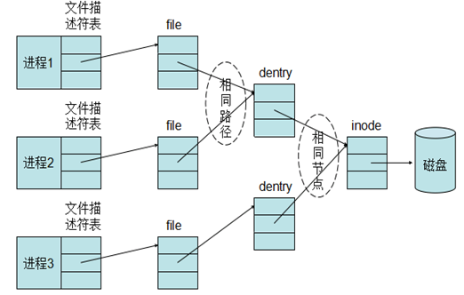
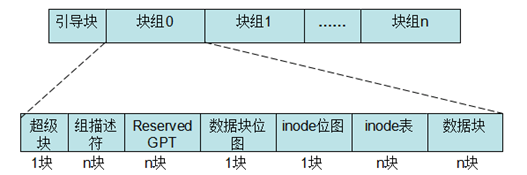
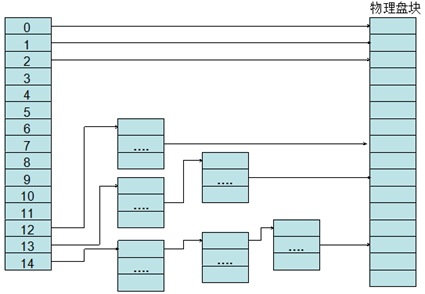
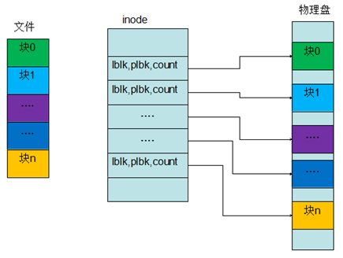
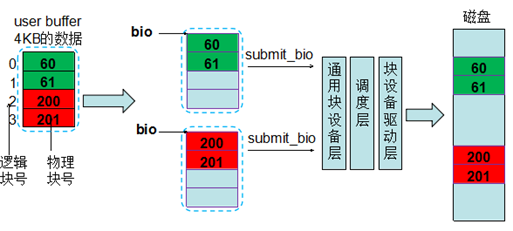
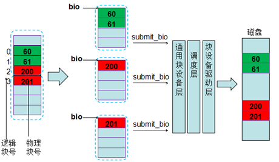
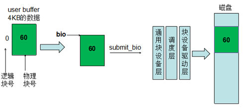

本文主要对文件系统的磁盘布局进行概要的梳理，并在此基础上分析文件系统I/O到块I/O的映射机制。
# 1.文件系统磁盘布局
首先文件系统层面来阐述文件与块设备的关系。
## 1.1文件描述符与inode
应用程序在访问文件时都会先打开文件，在内核中，对应每个进程，都会有一个文件描述符表表示这个进程打开的文件，但是用户程序不能直接访问内核中的文件描述符表,而只能使用文件描述符表的索引（一个整数），这些索引就被称为文件描述符。当调用open 打开一个文件或创建一个新文件时,内核分配一个文件描述符并返回给用户程序,该文件描述符表项中的指针指向新打开的文件。

文件描述表中每一项都是一个指针，指向一个用于描述打开的文件的数据块--file对象，file对象中描述了文件的打开模式，读写位置等重要信息，当进程打开一个文件时，内核就会创建一个新的file对象。需要注意的是，file对象不是专属于某个进程的，不同进程的文件描述符表中的指针可以指向相同的file对象，从而共享这个打开的文件。file对象有引用计数，记录了引用这个对象的文件描述符个数，只有当引用计数为0时，内核才销毁file对象，因此某个进程关闭文件，不影响与之共享同一个file对象的进程。

file对象中包含一个指针，指向dentry对象。dentry对象代表一个独立的文件路径，如果一个文件路径被打开多次，那么会建立多个file对象，但它们都指向同一个dentry对象。inode对象代表一个独立文件，inode 对象包含了最终对文件进行操作所需的所有信息，如文件系统类型、文件的操作方法、文件的权限、访问日期等。
<!--more-->

## 1.2文件系统磁盘布局
在了解了文件与inode的对应关系后，为了阐述文件与具体的物理块的映射关系，必须先理解文件系统的磁盘布局。下图是ext2/ext3文件系统的磁盘布局。

ext3文件系统将其所管理的磁盘或者分区(引导块除外)中的块划分到不同的块组中。每个块组大小相同，当然最后一个块组所管理的块可能会少一些，其大小在文件系统创建时决定，主要取决于文件系统的块大小。每个块组包含一个块位图块，一个inode位图块，一个或多个块用于描述 inode 表和用于存储文件数据的数据块，除此之外，还有可能包含超级块和所有块组描述符表。
块位图用于描述该块组所管理的块的分配状态，如果某个块对应的位未置位，那么代表该块未分配，可以进行分配使用。inode位图用于描述该块组所管理的inode的分配状态，每个inode对应文件系统中唯一的一个号，如果inode位图中相应位置位，那么代表该inode已经分配出去；否则可以使用。
## 1.3文件系统逻辑块映射
下面就来阐述文件与物理块的映射关系。
ext2/ext3采用的是直接+间接方式来存储这些地址映射：其中0~11是存储用户数据的物理块号(直接寻址)，12是存储一级地址映射表数据的物理块地址(一级间接寻址)，地址映射表中的每一项都是另外一个物理块号。13存储二级地址映射表地址，14存储三级地址映射表地址。这种方式对于小文件比较合适，对于大文件来说要经过很多次间接寻址，效率很低。

而ext4则采用的是extents的映射方式：[logicalStartBlock,physicalStartBlock, blockCount]。ext4中一个inode的大小是256Bytes，因此一个inode能容纳的extent有限，当文件增大到一定程度的时候，extent无法以数组形式存放，就会以B+tree的形式存放。相比于ext3的间接映射方式，extents的方式增加了大文件的效率并减少了分裂文件。

通过上面的阐述，我们知道了一个文件和具体物理块的对应关系，那么问题来了：用户以4KB大小对文件写一个I/O，对于磁盘来说是一个I/O吗？如果采用direct方式呢？如果是16KB大小的一个用户I/O呢？下面就从文件I/O到块I/O的映射机制来进行阐述。
# 2.文件I/O到块I/O的映射
文件系统创建时会指定块大小（一般512,1024,2048,4096字节），一个文件会根据文件系统块大小和文件的大小切分成各个逻辑块，文件系统就会为这些逻辑块分配空闲的物理块（ext4文件系统是延迟分配的），用户程序对一个文件进行读写时，文件系统就会根据对应的逻辑块找到具体的物理块，然后下发io请求到块设备层进行处理。

用户调用read()或write()系统调用进行io读写时，对应的缓冲区buf是用户进程空间的虚拟地址，在内核处理时将虚拟内存映射到到物理内存页。如果是缓存I/O，会经过用户缓冲到内核缓存（page cache）的拷贝，而Direct I/O则可以直接让内核态映射用户态虚拟内存对应的物理页，少了一次拷贝的过程。在从文件I/O到块I/O的映射处理过程中，缓存I/O的刷脏页和Direct I/O的方式类似，这里以Direct I/O进行简要分析，详细的可以去看内核代码里的submit_page_action，__bio_add_page等函数的实现。

用户程序在使用Direct I/O时，使用的buffer和读写的长度需要512字节的整数倍对齐，之所以这样要求，是因为非对齐的请求在底层构造bio时有可能会因为PageSize边界带来额外的I/O，从而需要多次下发请求，降低了效率。

一个文件I/O下发到底层会变成多少个块I/O，取决于文件系统块大小和用户缓冲区的对齐长度，以及该文件的逻辑块对应的物理块是否连续。下面以具体的例子来进行说明。
1）文件系统块大小是1KB ，用户发起一个4KB的请求，申请的buffer在一个页中（或者direc io下的按照4KB对齐）。图中绿色和红色方块里的数字表示对应的真实的物理块的块号，要读写的这个文件的4KB的数据，按照文件系统块大小切分，分成4个逻辑块（0~3），其中逻辑块0对应物理块60，逻辑块1对应物理块61，逻辑块2对应物理块200，逻辑块3对应物理块201（这些对应关系是由文件系统分配块时确定的）。逻辑块0和1对应的物理块是连续的，并且因为块大小是1KB，所以可以放在一个bio里，而逻辑块2和3对应的物理块与逻辑块0和1的物理块不连续，所以不能放在一个bio里，需要新生成一个bio。这样就调用了两次submit_bio下发到通用块层去处理，经过调度层（有可能和其他请求连续，从而进行合并），最后通过块设备驱动层下发到底层磁盘上。

2）文件系统块大小是1KB， 用户发起一个4KB的请求，申请的buffer不在一个页中（或者direc io下的按照1KB对齐）。请求落到两个页中，并且因为逻辑块2和逻辑块3对应的物理块不连续，所以构造bio时变成了3个bio（如果两个页中的逻辑块对应的物理块是连续的，则会放到一个bio里，每个bio可以包含多个页）。因此就会有3次submit_bio的调用。

3）文件系统块大小是4KB ，用户发起一个4KB的请求，申请的buffer在一个页中（或者direc io下的按照4KB对齐）。这里刚好一个页里只有1个逻辑块，所以只有一次submti_bio。

上面的几个示例就解释了第3节末尾提出的问题，一个文件I/O下发到底层会变成多少个块I/O，取决于文件系统块大小和用户缓冲区的对齐长度，以及该文件的逻辑块对应的物理块是否连续。
# 3.参考资料
1.《深入理解linux内核》
2.《Linux设备驱动程序》
3.《unix高级环境编程》
4.Linux内核源码3.10.45