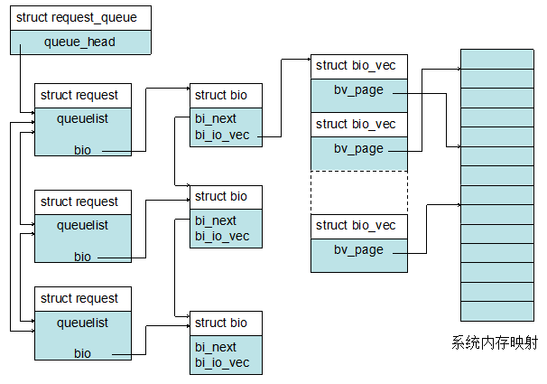
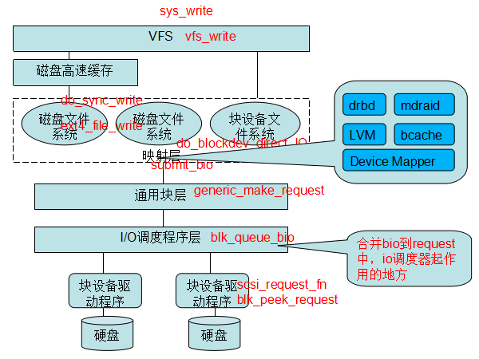
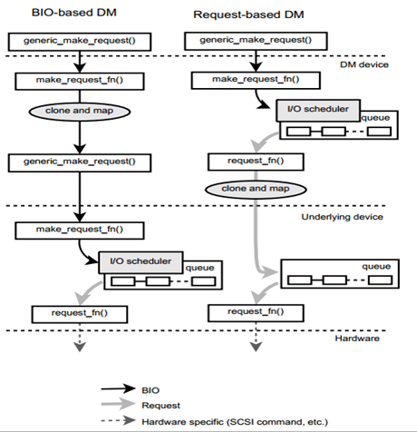

块存储，简单来说就是使用块设备为系统提供存储服务。块存储分多种类型，有单机块存储，网络存储（如NAS，SAN等），分布式块存储（目前主流的如AWS的EBS，青云的云硬盘，阿里云的云磁盘，网易云硬盘等）。通常块存储的表现形式就是一块设备，用户看到的就是类似于sda，sdb这样的逻辑设备。本文主要介绍Linux块设备，对Linux的块设备I/O栈进行分析。
# 1.块设备基本概念
块设备将信息存储在固定大小的块中，每个块都有自己的地址。对操作系统而言，块设备是以字符设备的外观展现的，例如/dev/sda，虽然对这种字符设备可以按照字节为单位访问，但是实际上到块设备上却是以块为单位（最小512byte，即一个扇区），这之间的转换是由操作系统来实现的。
    	下面介绍几个块设备的基本概念：
    	1）扇区：磁盘盘片上的扇形区域，逻辑化数据，方便管理磁盘空间，是硬件设备数据传送的基本单位，一般512Byte；
	2）块：块是VFS和文件系统数据传送的基本单位，必须是扇区的整数倍，格式化文件系统时，可以指定块大小（一般512,1024,2048,4096字节）；
   	3）段：一个内存页或者内存页中的一部分，包含一些相邻磁盘扇区中的数据；磁盘的每个I/O操作就是在磁盘与一些RAM单元之间相互传一些相邻扇区的内容，大多数情况下，磁盘控制器采用DMA方式进行数据传送。如果不同的段在RAM中相应的页框是连续的并且在磁盘上相应的数据块也是相邻的，就可以在通用块层合并它们，产生更大的内存区域，这个区域称为物理段。
通常情况下，我们是通过文件系统来访问块设备，也可以直接使用裸设备，通过指定偏移和大小来读写裸设备。
常见的块存储设备就是物理磁盘，在Linux系统下，还提供基于其他块设备之上的逻辑设备，如Device Mapper，软RAID等。
<!--more-->
# 2.块设备I/O栈
## 2.1基本概念
介绍块设备的I/O栈之前，我们先来了解一下块I/O栈的几个基本概念。
    	1）bio：bio是通用块层I/O请求的数据结构，表示上层提交的I/O请求，一个bio包含多个page，这些page必须对应磁盘上一段连续的空间。由于文件在磁盘上并不连续存放，文件I/O提交到块设备之前，极有可能被拆成多个bio结构；
    	2）request：表示块设备驱动层I/O请求，经由I/O调度层转换后的I/O请求，将会发到块设备驱动层进行处理；
    	3）request_queue： 维护块设备驱动层I/O请求的队列，所有的request都插入到该队列，每个磁盘设备都只有一个queue（多个分区也只有一个）；
    	这3个结构的关系如下图示：一个request_queue中包含多个request，每个request可能包含多个bio，请求的合并就是根据各种原则将多个bio加入到同一个requesst中。

## 2.2 请求处理方式

如图所示是块设备的I/O栈，其中的红色文字表示关键I/O路径的函数。
为了描述I/O处理流程，先介绍一下Direct I/O和缓存I/O的区别：
    	1）Direct I/O绕过page cache，而缓存I/O都是写到page cache里就表示写请求完成，然后由文件系统的刷脏页机制把数据刷到磁盘。因此，使用缓存I/O，掉电时有可能page cache里的脏数据未刷到磁盘上，造成数据丢失；
    	2）缓存I/O机制中，DMA方式可以将数据直接从磁盘读到page cache中，或者将数据从page cache直接写回到磁盘上，而不能直接在应用程序地址空间和磁盘之间进行数据传输，这样的话，数据在传输过程中需要在应用程序地址空间和page cache之间进行多次数据拷贝操作，这些数据拷贝操作所带来的CPU以及内存开销是非常大的。而Direct I/O的优点就是通过减少操作系统内核缓冲区和应用程序地址空间的数据拷贝次数，降低了对文件读取和写入时所带来的CPU的使用以及内存带宽的占用，但是Direct I/O的读操作不能从page cache中获取数据，会直接从磁盘上读取，带来性能上的损失。一般Direct I/O与异步I/O结合起来使用提高性能。
    	3）Direct I/O要求用户态的缓冲区对齐；
    	4）Direct I/O一般用于需要自己管理缓存的应用如数据库系统。

对于I/O的读写流程，逻辑比较复杂，这里以写流程简单描述如下：
    	1）用户调用系统调用write写一个文件，会调到sys_write函数；
    	2） 经过VFS虚拟文件系统层，调用vfs_write， 如果是缓存写方式，则写入page cache，然后就返回，后续就是刷脏页的流程；如果是Direct I/O的方式，就会走到do_blockdev_direct_IO的流程；
    	3）如果操作的设备是逻辑设备如LVM，MDRAID设备等，会进入到对应内核模块的处理函数里进行一些处理，否则就直接构造bio请求，调用submit_bio往具体的块设备下发请求，submit_bio函数通过generic_make_request转发bio，generic_make_request是一个循环，其通过每个块设备下注册的q->make_request_fn函数与块设备进行交互；
    	4）请求下发到底层的块设备上，调用块设备请求处理函数__make_request进行处理，在这个函数中就会调用blk_queue_bio，这个函数就是合并bio到request中，也就是I/O调度器的具体实现：如果几个bio要读写的区域是连续的，就合并到一个request；否则就创建一个新的request，把自己挂到这个request下。合并bio请求也是有限度的，如果合并后的请求超过阈值（在/sys/block/xxx/queue/max_sectors_kb里设置）,就不能再合并成一个request了，而会新分配一个request；
    	5）接下来的I/O操作就与具体的物理设备有关了，交由相应的块设备驱动程序进行处理，这里以scsi设备为例说明，queue队列的处理函数q->request_fn对应的scsi驱动的就是scsi_request_fn函数，将请求构造成scsi指令下发到scsi设备进行处理，处理完成后就会依次调用各层的回调函数进行完成状态的一些处理，最后返回给上层用户。

## 2.3 request-based和bio-based
在块设备的I/O处理流程中，会涉及到两种不同的处理方式：
    	1）request-based：这种处理方式下，会进行bio合并到request（即I/O调度合并）的流程，最后才把请求下发到物理设备。目前使用的物理盘都是request-based的设备；
    	2）bio-based：在逻辑设备自己定义的request处理函数make_request_fn里进行处理，然后调用generic_make_request下发到底层设备。ramdisk设备、大部分Device Mapper设备、virtio-blk都是bio-based；
下图从Device Mapper的角度来说明request-based和bio-based处理流程的区别。

一个需要注意的地方是，Device mapper目前只有multipath插件是request-based的，其他的如linear，strip都是bio-based，所以如果是linear DM设备上创建的一个文件系统，对这个文件系统里的文件进行读写，采用缓存I/O时，即使刷脏页时是连续的请求，在DM设备上也不会进行合并，只会到底层的设备（如/dev/sdb）上才进行合并。
# 4.参考文献
1.《深入理解LINUX内核》
2.《LINUX设备驱动程序》
3.《[Linux中直接I/O机制介绍](http://www.ibm.com/developerworks/cn/linux/l-cn-directio/ "")》
4.《[Linux I/O stack](http://www.thomas-krenn.com/en/wiki/Linux_Storage_Stack_Diagram#Diagram_for_Linux_Kernel_3.17 "")》
5.《Request-based Device-mapper multipath and Dynamic load balancing》

