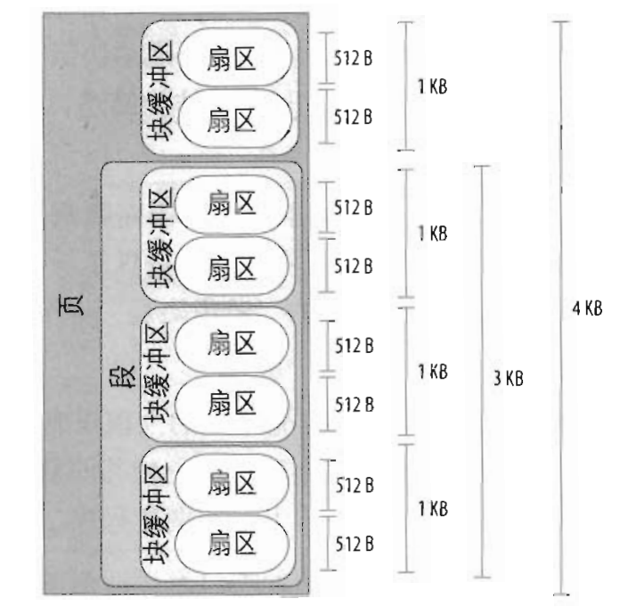

在DMA设备不采用S/G（分散/聚集）模式的情况下，必须保证缓冲区是物理上连续的，linux内核有两个函数用来分配连续的内存：kmalloc()和__get_free_pages()。这两个函数都有分配连续内存的最大值，kmalloc以分配字节为单位，最大约为64KB，__get_free_pages()以分配页为单位，最大能分配2^order数目的页

使用DMA缓冲区的主要问题是：当大于一页时，它们必须占据连接的物理页，这是因为设备使用ISA或者PCI系统总线传输数据，而这两种方式使用的都是物理地址

linux块设备在处理io时会受到一些参数（设备的queue limits参数，以下简称limits参数）的影响，比如一个请求中允许的最大扇区数，最大segment数等。这些参数可以在/sys/block/<device>/queue/下查看，块设备在初始化时会设置默认值。这里主要分析max_segments和max_sectors_kb。

# 1.基本概念
## 1.1段的概念
首先就需要了解一下什么是段（segment）。
一个段就是一个内存页或者内存页的一部分，它们包含磁盘上物理相邻的数据块。
磁盘的每个io操作就是磁盘与一些RAM单元之间相互传送一些相邻扇区的内容。大多数情况下，磁盘控制器采用DMA方式传送数据，块设备驱动程序只要向磁盘控制器发送适当的命令就可以触发一次数据传送，一旦完成数据传送，磁盘控制器就会发出一个中断通知块设备驱动程序。
DMA方式传送的是磁盘上相邻的扇区数据，虽然也允许传送不相邻的扇区数据，但是这个比较低效，因为磁头移动慢。
老的磁盘控制器仅仅支持“简单”的DMA方式：磁盘必须与RAM中连续的内存单元传送数据。但是新的磁盘控制器支持分散聚集（scatter-gather）DMA方式，磁盘可以与一些非连续的内存区域相互传送数据。
为了支持分散聚集DMA方式，块设备驱动程序必须能够处理称为段的数据存储单元，一次分散聚集DMA可以传送几个段。
如果不同的段在RAM中相应的页框正好是连续的并且在磁盘上相应的数据也是相邻的，那么通用块层就可以进行合并，这种合并方式产生的更大的内存区域就称为物理段。
<!--more-->


## 1.2各参数含义
max_segments表示设备能够允许的最大段的数目。
max_sectors_kb表示设备允许的最大请求大小。
max_hw_sectors_kb表示单个请求所能处理的最大KB（硬约束）

# 2.limits参数的设置及影响

## 2.1limits默认值的设置
一般的块设备在初始化时会调用blk_queue_make_request设置make_request回调函数，与此同时，还会调用blk_set_default_limits设置设备queue的限制的默认值，默认的值如下。
```cpp
enum blk_default_limits {
 BLK_MAX_SEGMENTS	= 128,
 BLK_SAFE_MAX_SECTORS	= 255,
 BLK_DEF_MAX_SECTORS	= 1024,
 BLK_MAX_SEGMENT_SIZE	= 65536,
 BLK_SEG_BOUNDARY_MASK	= 0xFFFFFFFFUL,
};
```
## 2.2 DIRECT IO中max_segments和max_sectors_kb
使用direct io时，跳过文件系统的cache，io直接下发到块设备。以write为例，io path如下：
```cpp
sys_write() --> vfs_write() --> do_sync_write() --> blkdev_aio_write() --> __generic_file_aio_write() --> generic_file_direct_write() --> blkdev_direct_IO() --> __blockdev_direct_IO() --> submit_page_section() --> dio_send_cur_page() --> dio_bio_submit() --> submit_bio() --> generic_make_request()
```

在dio_send_cur_page 中，会尝试将连续的请求合并成一个bio，然后返回，如果合并失败或者当前请求与已有的bio不连续，就直接dio_bio_submit提交请求。
其中dio_bio_add_page() --> bio_add_page() --> __bio_add_page() 是将当前请求合并到bio中。

### 1）max_segments
在 __bio_add_page有如下一段代码，会判断bio中的物理段数目是否超过设备的max_segments，如果超过就返回0表示add page失败，从而会调用dio_bio_submit 提交请求。
```cpp
 while (bio->bi_phys_segments >= queue_max_segments(q)) {
  if (retried_segments)
   return 0;
  retried_segments = 1;
  blk_recount_segments(q, bio);
 }
 ```
### 2）max_sectors_kb
同样是在__bio_add_page中，
```cpp
 if (((bio->bi_size + len) >> 9) > max_sectors)
  return 0;
```
其中max_sectors就是设备的max_sectors_kb*2，即是当该bio的大小超过max_sectors_kb时，就返回0表示add page失败，这样就会调用dio_bio_submit提交请求。

## 2.3 Device Mapper设备的limits参数
device mapper设备（简称dm设备）在刚开始创建初始化时会先设置成默认值，然后再会根据其底层的设备和默认值，两者取最小值来设置dm设备的限制值。其流程如下：
```cpp
dm_create() --> alloc_dev() --> dm_init_md_queue() --> blk_queue_make_request()设置默认值
```
然后在dm_calculate_queue_limits中先设置成默认，然后会最终调用blk_stack_limits，取底层设备和dm设备的这些参数的最小值来设置dm的参数。
```cpp
do_resume() --> dm_swap_table() --> dm_calculate_queue_limits() --> ti->type->iterate_devices() -->dm_set_device_limits() --> bdev_stack_limits() --> blk_stack_limits()
```
不过在不同的内核中还有些不同，上面描述的是3.2.54内核的流程，在新内核(3.10.11)中，设置成默认的流程也一样，不过在dm_calculate_queue_limits中调用了blk_set_stacking_limits()，这个函数会把limits参数设置成极大值，这样在后续调用blk_stack_limits的时候，也是取两者最小值，不过这个时候因为dm的limits参数是极大值，所以会使用底层设备的limits参数的值来设置dm的limits参数。
这样做的好处在于可以继承底层设备的限制，底层设备都能处理这些limits参数，在它们之上的dm设备同样也可以。
这里附上blk_set_stacking_limits的代码
```cpp
void blk_set_stacking_limits(struct queue_limits *lim)
{
 blk_set_default_limits(lim);
 /* Inherit limits from component devices */
 lim->discard_zeroes_data = 1;
 lim->max_segments = USHRT_MAX;
 lim->max_hw_sectors = UINT_MAX;
 lim->max_sectors = UINT_MAX;
 lim->max_write_same_sectors = UINT_MAX;
}
```

## 2.4 软raid设备中的limits参数
软raid的创建过程参考http://blog.csdn.net/liumangxiong/article/details/12405231<br>
简单来说，就是分配设备，初始化数据结构，注册请求处理函数，根据不同的raid级别再进行一些必要的初始化。
调用关系如下：
```cpp
md_init() --> md_probe() --> md_alloc() --> blk_queue_make_request()
```
之前已经说到在blk_queue_make_request中会注册make_request_fn，并且会设置limits参数的默认值。
```cpp
do_md_run --> md_run() --> mddev->pers->run(mddev) 对应raid1中的run() --> 会遍历raid中的设备，分别调用disk_stack_limits() --> bdev_stack_limits() --> blk_stack_limits()
```
这里也是会根据md设备和其底层的成员设备的queue->limits参数，两者取最小值。

与device mapper设备类似，在不同内核下limits参数设置还有些不同。
上面描述的是3.2.54内核下的流程。
在3.10.11内核下，md_alloc中在调用blk_queue_make_request之后还会调用blk_set_stacking_limits将md设备的limits参数设置为极大值。
这样就能在blk_stack_limits中取最小值时继承底层设备的limits参数。

在使用fio在这两个内核下对软raid1测试的时候，就会发现区别，当fio使用大于127KB的块大小时，在3.2.54内核使用iostat就会看到实际落到md设备的io大小小于fio下发的大小，在3.10.11就没有这个问题。

另外，需要提到的是在3.10.11内核中也没有《systemtap分析软raid1 io拆分问题》中max_segments设置为1的问题，因为新内核的raid1中的run()函数中已经取消掉这段代码
```cpp
 if (rdev->bdev->bd_disk->queue->merge_bvec_fn) {
   blk_queue_max_segments(mddev->queue, 1);
   blk_queue_segment_boundary(mddev->queue,
         PAGE_CACHE_SIZE - 1);
  }
```
这样就不会将max_segments设置成1了。

# s3. 参考资料
1）《深入理解linux内核》
2）《linux设备驱动程序》
3）软raid代码分析http://blog.csdn.net/liumangxiong/article/details/12405231
4）https://www.kernel.org/doc/Documentation/block/queue-sysfs.txt
5）3.2.54及3.10.11内核源代码