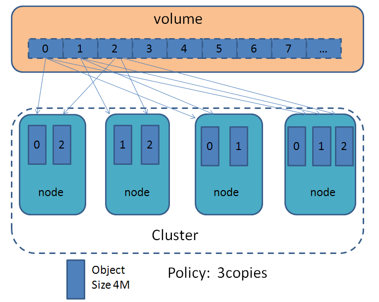
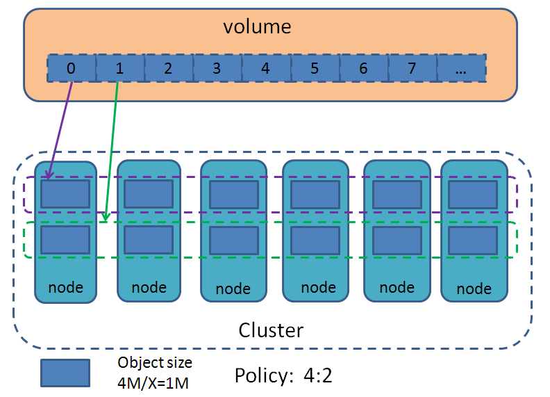
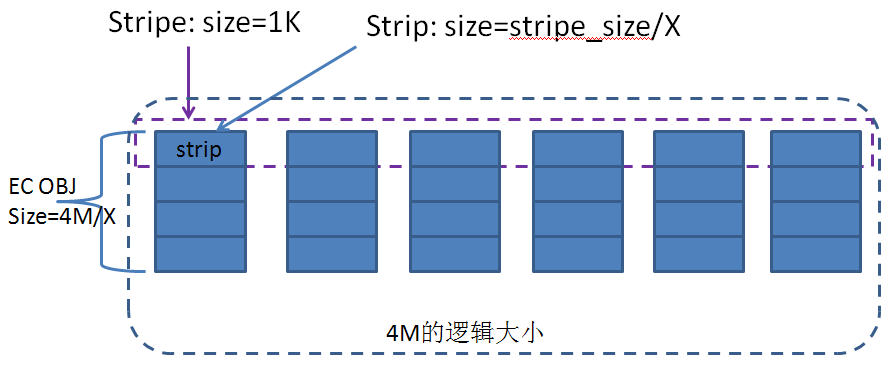
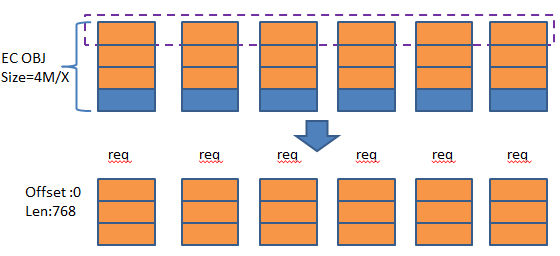
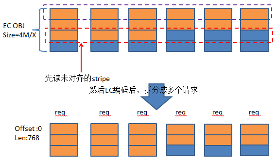

# 1.简介
Erasure Coding(EC) 是一种数据冗余策略，相比于多副本策略，纠删码的数据冗余度更小，并能获得更高的数据可靠性。纠删码包含两部分，编码和解码。编码时，使用一些数据部分，计算出一些校验数据；当有数据丢失时，能够使用余下的数据（源数据和校验数据）解码出丢失的部分。sheepdog中也提供了EC的支持。比如使用8:3的纠删策略（8块数据块，3块校验块），sheepdog就能够容错3个节点宕掉，仅仅只有3/8=0.375倍的额外数据，而要达到相同的效果，多副本策略却需要使用4副本，并且带来了额外3倍的数据开销。sheepdog中使用的是Erasure Code的开源库zfec。

# 2.sheepdog中EC的特性
* 1）一旦指定了EC策略，读写数据时自动地使用EC策略，不需要额外的操作；
* 2）支持随机读写，就地更新，非对齐的读写；
* 3）支持任意类型的VM镜像；
* 4）使用VDI时，用户可以自定义EC策略；
* 5）相对于多副本策略，EC能够获得更好的读写性能；
* 6）一个集群中既能有多副本的卷，也能有EC的卷。

# 3.使用方式
用户创建VDI（虚拟卷）时，可以指定EC策略。
$dogvdi create -c x:y vdi size # Create a erasure coded VDI
x表示数据块的个数，x只能是{2,4,8,16}，y表示校验块的个数，y可以取值1~15，能够容错y个节点宕掉。
当然，如果节点个数小于x+y，指定的策略将会失败。
初始化集群时，也可以使用EC作为默认的副本策略。
$ dog cluster format -c x:y

<!--more-->
# 4.数据分布
sheepdog中的多副本策略，使用的对象大小是4M（对应代码中的SD_DATA_OBJ_SIZE），在各个存储节点的本地目录下存的对象都是4M大小的文件。多副本策略下的（示例是3副本）的数据分布如下图所示。

采用Erasure code后，卷的数据分布如下图：

EC的策略为X：Y，图上示例是4:2，即4个数据库，2个校验块，对应卷的4M大小的空间，实际上是分布到x+y（图上为6）个节点上，每个节点上的EC块大小为4MB/X（示例中是1MB）。也就是说，4:2策略下在各节点本地存的EC卷的文件大小是1M。EC块的分布策略与多副本时各副本的分布策略一致，都是采用一致性哈希的分布方式，图上只是画了6个节点，大于6个节点时，EC的6个块就会分布到这些节点中的6个节点。

在实现时，是切分成更细的粒度，这里引入几个概念:
* EC OBJ：EC的对象块（示例中是1M大小），一个EC OBJ的命名是以OBJ的id（oid）加上index，比如一个oid是 007c2b2500000001，则EC OBJ是命名为 007c2b2500000001_1的形式。
* stripe：横跨多个节点的EC的一个条带，大小为SD_EC_DATA_STRIPE_SIZE（=1k）
* strip：组成stripe的基本单元，大小为SD_EC_DATA_STRIPE_SIZE/X（X为EC策略X：Y中的数据块个数）

如下图所示，对于VDI的一个4M的空间大小，实际上是分布到多个节点上的EC OBJ共同提供的。了解raid的人应该不难理解，就跟raid5/6中块分布到多个磁盘类似。

为什么是1K而不是其他大小呢？ 
从社区及代码中得知，设定stripe大小为1K是经过了一些测试确定的，stripe小于等于1k对于运行虚拟机来说是一个安全的值。 
尽管大多数系统的文件系统都是处理4K的块，有些软件，比如grub就会操作512字节，linux内核本身也偶尔会操作1K的块。 
经过一些测试认为，如果想在采用EC策略的卷上运行虚拟机，1K是可选择的最大值。

# 5.读写请求处理
sheepdog使用的EC支持对齐和非对齐的读写方式，对齐是指请求的偏移和大小都以SD_EC_DATA_STRIPE_SIZE的大小1k为对齐。
在处理上层到来的读写请求时，sheepdog是按照4M大小的请求来处理的，也就是说不大于4M大小的请求，下发到sheepdog这里是一个请求（每个数据读写的请求都有个oid，表示数据对象的id），大于4M大小的请求在客户端就拆分成多个4M大小的请求。而对于每个4M内的请求，根据请求的偏移和大小，按照EC策略，拆分成多个小请求，分别发到不同的节点上去进行读写操作，这些小请求都成功后才算成功。

## 1）对齐方式的处理
以一个请求为例进行说明，该请求offset为0（刚好对齐到某个4M的起始位置），len为3K.

该请求被拆分为6个请求，分别去对应节点上去读写相应的EC OBJ。写请求是写成功就完了，而读请求需要把各自读到的内容按照图上箭头的逆过程拷贝到用户请求的缓冲区中。图中没有区分数据块和校验块，其实是有EC的编码过程的（根据数据块编码出校验块），图上忽略了这个过程。

## 2）非对齐的处理
非对齐的读请求的处理与对齐的没有区别。
但是对于非对齐的写请求，需要先把未对齐的那个stripe读出来，因为需要计算校验。非对齐有可能是偏移未对齐，或者请求大小未对齐，或者两者都未对齐。这里以请求大小未对齐为例。请求相对偏移为0，请求大小为2560Byte。

先读出未对齐的stripe，和待写数据一起经过EC编码后，再拆分成多个请求，发到各个节点进行处理。
非对齐的写有额外的读操作，会读写性能有所影响，所以是不建议使用非对齐的io请求。

## 3）错误处理
采用erasure code副本策略，如果有1个或多个写入失败了时如何处理？ 
假设总的节点数为n，ec策略为x：y，测试时用fio跑，使用kill杀掉几个sheep节点进程，从log中可以看到有失败的信息，但是fio并没有报错，因为还活着的节点数大于等于x，就还能继续写，也就是说，写失败了会重试，如果活着的节点数小于x，那么就会直接io 报错了。 
erasure的读失败时，也会重试，如果是节点挂了引起的，这个重试的读会等到该data strip恢复后才能够读成功。