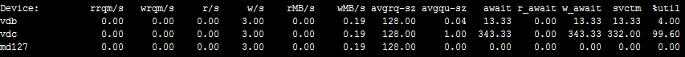
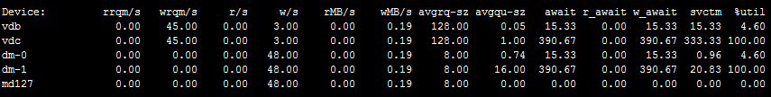
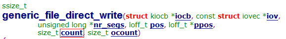
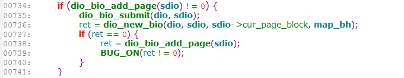
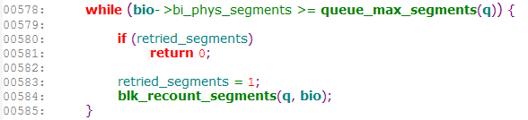
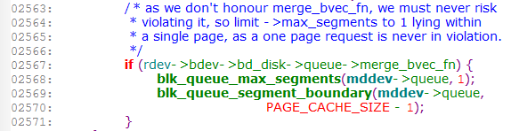

使用linux 软raid1的时候遇到个奇怪的问题，就是当使用逻辑设备（比如device mapper设备）来创建软raid设备时，对该软raid的大块读写，都会被拆分为4k块大小的io；而使用裸设备（如sdb，sdc，vdb，vdc这种设备）来创建软raid设备时，对该软raid的大块读写就不会有io拆分问题。下面以例子说明这个现象（以raid1，写操作为例）。

# 情形一：使用裸设备创建软raid1

```bash
# mdadm –create /dev/md/md_test1 –run –force –metadata=0.9 –assume-clean –level=1 –raid-devices=2 /dev/vdb /dev/vdc
# cat /proc/mdstat
Personalities : [raid1]
md127 : active (auto-read-only) raid1 vdc[1] vdb[0]
      20971456 blocks [2/2] [UU]
```
使用fio对该raid1进行随机写操作（顺序写也是一样的），块大小为64KB，fio的配置如下:
```bash
[global]
rw=randwrite
direct=1
numjobs=1
ioengine=sync
bsrange=64k-64k
rate_iops=60
time_based
runtime=120
group_reporting
[disk00]
filename=/dev/md127
```
fio写io过程中，使用iostat查看设备的io
```bash
#iostat -mx 2 md127 vdb vdc
```

可以看到avgrq-sz为128，单位是扇区，也就是64KB，说明io并没有进行拆分。

<!--more-->

# 情形二：使用逻辑设备（device mapper设备）创建raid1
这里先用vdb和vdc分别创建device mapper设备，然后再用这两个dm设备创建raid1
```bash
#echo "0 41943040 linear /dev/vdb 0" | dmsetup create testdisk1
#echo "0 41943040 linear /dev/vdc 0" | dmsetup create testdisk2
#mdadm --create /dev/md/md_test1 --run --force --metadata=0.9 --assume-clean --level=1 --raid-devices=2  /dev/mapper/testdisk1 /dev/mapper/testdisk2
## cat /proc/mdstat
Personalities : [raid1]
md127 : active (auto-read-only) raid1 dm-1[1] dm-0[0]
      20971456 blocks [2/2] [UU]
```
fio配置文件不变，对md127进行写操作，iostat查看设备io
```bash
#iostat -mx 2 md127 dm-0 dm-1 vdb vdc
```

可以看到md127和dm-0，dm-1上的io块大小都是4KB，实际上对md127发的是64KB的块大小的io，说明io进行了拆分。另外，vdb和vdc上的io块大小64KB与fio发的io大小一致，io又进行了合并，后面会解释为什么会是这样的情况。

# systemtap分析io栈
对于上面的问题，需要弄清楚使用逻辑设备创建的raid为什么io会进行拆分，如果能够看到块io每一层次调用时的io块大小，就可以知道在哪一层进行了拆分。这个时候就需要祭出神器systemtap。不过要使用systemtap还得对内核有一定的了解，一时半会要弄清楚linux内核的某一块很艰难，因此就只能对照着内核代码，查找关键函数的调用处来进行分析。最好使用与系统版本一致的内核源码，这样就可以更好地利用systemtap的kernel.statement进行探测。我的虚拟机系统使用的是3.2.54版本的内核，所以下面的分析就是以3.2.54内核代码为准。

既然是对软raid写io的时候发现io进行了拆分，首先就从md raid这一层入手，io进入软raid会经过md_make_request（md.c中）进行处理，在该函数里会根据raid的不同级别调用不同make_request（如raid1.c中的make_request）。因此，先查看md_make_request的函数调用栈，md_make_request是软raid的内核模块md_mod中的。在使用fio对软raid写操作时，使用下面的systemtap脚本探测。

*注意：这里使用systemtap要加上--all-modules，如果不加上，可能会导致打印的函数栈不全*

```bash
#stap --all-modules -e 'probe module("md_mod").function("md_make_request"){printf("======================\n");print_backtrace()}'

======================
 0xffffffffa0102c59 : md_make_request+0x0/0x1db [md_mod]
 0xffffffff811993d2 : generic_make_request+0x90/0xcf [kernel]
 0xffffffff811994e4 : submit_bio+0xd3/0xf1 [kernel]
 0xffffffff811236a4 : dio_bio_submit+0x6e/0x8d [kernel]
 0xffffffff8112399d : dio_send_cur_page+0x79/0xa4 [kernel]
 0xffffffff81123a6b : submit_page_section+0xa3/0xf8 [kernel]
 0xffffffff8112435f : __blockdev_direct_IO+0x751/0xa67 [kernel]
 0xffffffff81122312 : blkdev_direct_IO+0x4e/0x53 [kernel]
 0xffffffff810b5e1c : generic_file_direct_write+0xdc/0x14c [kernel]
 0xffffffff810b6020 : __generic_file_aio_write+0x194/0x278 [kernel]
 0xffffffff81122629 : blkdev_aio_write+0x1f/0x61 [kernel]
 0xffffffff810fa378 : do_sync_write+0xb4/0xec [kernel]
 0xffffffff810faa69 : vfs_write+0xa2/0xe9 [kernel]
 0xffffffff810fac46 : sys_write+0x45/0x6b [kernel]
 0xffffffff81354d92 : system_call_fastpath+0x16/0x1b [kernel]
```

# systemtap的几点使用方法
有了这个函数调用关系，就可以对每个函数探测，查看io大小，这就需要对照着内核代码查看函数的参数中io大小的参数，比如generic_file_direct_write中的count

然后可以使用stap -L 'kernel.function("function")'查看该函数有哪些参数可以探测。
```bash
# stap -L 'kernel.function("generic_file_direct_write")'
kernel.function("generic_file_direct_write@/build/linux-FpPMO6/linux-3.2.54/mm/filemap.c:2266") $iocb:struct kiocb* $iov:struct iovec const* $nr_segs:long unsigned int* $pos:loff_t $ppos:loff_t* $count:size_t $ocount:size_t $file:struct file* $write_len:size_t
```
如果参数是一个结构体，为了省去一个字段一个字段去打印，可以使用$var$$这样的方式把整个结构体都打印出来
```bash
# stap -e 'probe kernel.function("__blockdev_direct_IO"){printf("[__blockdev_direct_IO] nr_segs:%d, iov:%s\n", $nr_segs, $iov$$)}'
[__blockdev_direct_IO] nr_segs:1, iov:{.iov_base=0x21ff000, .iov_len=65536}
[__blockdev_direct_IO] nr_segs:1, iov:{.iov_base=0x21ff000, .iov_len=65536}
[__blockdev_direct_IO] nr_segs:1, iov:{.iov_base=0x21ff000, .iov_len=65536}
```
对于有的内核函数，没有可探测的参数时，比如
```bash
# stap -L 'kernel.function("dio_send_cur_page")'
kernel.function("dio_send_cur_page@/build/linux-FpPMO6/linux-3.2.54/fs/direct-io.c:693")
```
如果仍然去打印该函数的参数时就会报错
```bash
#stap -e 'probe kernel.function("dio_send_cur_page"){printf("[dio_send_cur_page] sdio:%s\n", $sdio$$)}'
semantic error: unable to find local 'sdio', [man error::dwarf] dieoffset 0x13b5772 in kernel, near pc 0xffffffff811239c1 in dio_send_cur_page /build/linux-FpPMO6/linux-3.2.54/fs/direct-io.c (<no alternatives>): identifier '$sdio$$' at <input>:1:87
        source: probe kernel.function("dio_send_cur_page"){printf("[dio_send_cur_page] sdio:%s\n", $sdio$$)}
                                                                                                      ^
```
这个时候就需要换一种方式，可以使用kernel.statement探测某一行的变量
dio_send_cur_page函数在fs/direct-io.c中693行开始，所以可以对该函数内的某一行的变量进行打印
```bash
# stap -e 'probe kernel.statement("*@fs/direct-io.c:700"){printf("[dio_send_cur_page] bio size:%d\n", $sdio->bio->bi_size)}'
[dio_send_cur_page] bio size:4096
[dio_send_cur_page] bio size:4096
[dio_send_cur_page] bio size:4096
```

# systemtap分析情形一和情形二
使用的systemtap脚本如下：
```bash
probe kernel.function("generic_file_direct_write")
{
    printf("[generic_file_direct_write] size:%d\n", $count)
}
probe kernel.function("__blockdev_direct_IO")
{
    printf("[__blockdev_direct_IO] nr_segs:%d, iov:%s\n", $nr_segs, $iov$)
}
probe kernel.statement("*@fs/direct-io.c:774")
{
    if($sdio->bio)
        printf("[submit_page_section] size:%d\n", $sdio->bio->bi_size)
}
probe kernel.statement("*@fs/direct-io.c:700")
{
    printf("[dio_send_cur_page] size:%d\n", $sdio->bio->bi_size)
}
probe kernel.function("dio_bio_submit")
{
    printf("[dio_bio_submit] size:%d\n", $sdio->bio->bi_size)
}
probe kernel.function("submit_bio")
{
    printf("[submit_bio] size:%d\n", $bio->bi_size)
}
probe module("md_mod").function("md_make_request")
{
    printf("[md_make_request] size:%d\n", $bio->bi_size)
}
```
使用上面的systemtap脚本分别对情形一和情形二进行探测，这里测试时使用的块大小为32KB

**情形二**的结果如下：
```bash
[generic_file_direct_write] size:32768
[__blockdev_direct_IO] nr_segs:1, iov:{.iov_base=0xcd0000, .iov_len=32768}
[submit_page_section] size:4096
[dio_send_cur_page] size:4096
[dio_bio_submit] size:4096
[submit_bio] size:4096
[md_make_request] size:4096
[submit_page_section] size:4096
[dio_send_cur_page] size:4096
[dio_bio_submit] size:4096
[submit_bio] size:4096
[md_make_request] size:4096
[submit_page_section] size:4096
[dio_send_cur_page] size:4096
[dio_bio_submit] size:4096
[submit_bio] size:4096
[md_make_request] size:4096
[submit_page_section] size:4096
[dio_send_cur_page] size:4096
[dio_bio_submit] size:4096
[submit_bio] size:4096
[md_make_request] size:4096
[submit_page_section] size:4096
[dio_send_cur_page] size:4096
[dio_bio_submit] size:4096
[submit_bio] size:4096
[md_make_request] size:4096
[submit_page_section] size:4096
[dio_send_cur_page] size:4096
[dio_bio_submit] size:4096
[submit_bio] size:4096
[md_make_request] size:4096
[dio_send_cur_page] size:4096
[dio_bio_submit] size:4096
[submit_bio] size:4096
[md_make_request] size:4096
[dio_bio_submit] size:4096
[submit_bio] size:4096
[md_make_request] size:4096
[generic_file_direct_write] size:32768
[__blockdev_direct_IO] nr_segs:1, iov:{.iov_base=0xcd0000, .iov_len=32768}
[submit_page_section] size:4096
........
```
结果中可以看出在__blockdev_direct_IO里进行了io拆分，本来是32KB的块大小的io，拆分成了4KB的io（正好是一个page），所以dio_bio_submit，submit_bio，md_make_request都调用了8次（32KB/4KB=8)，而dio_send_cur_page只调用了7次，少了一次，应该是第八次的时候直接调用了dio_bio_submit。

对于**情形一**的结果：
```bash
[generic_file_direct_write] size:32768
[__blockdev_direct_IO] nr_segs:1, iov:{.iov_base=0x2139000, .iov_len=32768}
[submit_page_section] size:4096
[dio_send_cur_page] size:4096
[submit_page_section] size:8192
[dio_send_cur_page] size:8192
[submit_page_section] size:12288
[dio_send_cur_page] size:12288
[submit_page_section] size:16384
[dio_send_cur_page] size:16384
[submit_page_section] size:20480
[dio_send_cur_page] size:20480
[submit_page_section] size:24576
[dio_send_cur_page] size:24576
[dio_send_cur_page] size:28672
[dio_bio_submit] size:32768
[submit_bio] size:32768
[md_make_request] size:32768
[generic_file_direct_write] size:32768
[__blockdev_direct_IO] nr_segs:1, iov:{.iov_base=0x2139000, .iov_len=32768}
[submit_page_section] size:4096
........
```
可以看到dio_send_cur_page每调用一次，size都变大了，刚好每次增加4KB，猜测是在__blockdev_direct_IO按page大小将io拆分，然后在dio_send_cur_page进行io合并，合并后下发到软raid设备上的io由变成了32KB。

# 深入分析io合并问题
接下来就是要弄清楚为什么情形二中，dio_send_cur_page中合并页会失败。
在dio_send_cur_page函数中会判断前一个请求与当前请求是否是连续的，如果是就会调用dio_bio_add_page进行合并，如果不是就会直接调用dio_bio_submit下发请求。

测试时每次用fio发32KB的请求，到dio_send_cur_page这一层变成4KB，因此每8个请求是连续的（从情形一的分析结果中也能看出来），对于情形二，也应该是连续的才对，可是结果却是dio_send_cur_page这里没有合并其他相邻的io或者是合并失败了，dio_send_cur_page函数中有这么一处代码：


调用dio_bio_add_page进行合并，如果合并失败，就会直接调用dio_bio_submit把当前请求提交。
怀疑情形二中是因为这个地方合并失败了。
dio_bio_add_page中又是调用bio_add_page进行合并，bio_add_page调用__bio_add_page，所以这里注意关注__bio_add_page返回失败的地方。有几处return 0的地方，为了快速找出情形二是在哪一处return 0的，可以分别在这几处return 0的地方使用systemtap探测。

将下面的脚本加到上面使用的systemtap脚本中
```bash
probe kernel.statement("*@fs/bio.c:530")
{
    printf("aaaaaaaaaaaaaaaaaaaaaaaaaaa\n")
}
probe kernel.statement("*@fs/bio.c:561")
{
    printf("cccccccccccccccccccccc\n")
}
probe kernel.statement("*@fs/bio.c:581")
{
    printf("ddddddddddddddddddddddd\n")
}
probe kernel.statement("*@fs/bio.c:616")
{
    printf("eeeeeeeeeeeeeeeeeeeeee\n")
}
```

对于情形二执行的结果如下：
```bash
[generic_file_direct_write] size:32768
[__blockdev_direct_IO] nr_segs:1, iov:{.iov_base=0xccd000, .iov_len=32768}
[submit_page_section] size:4096
[dio_send_cur_page] size:4096
ddddddddddddddddddddddd
[dio_bio_submit] size:4096
[submit_bio] size:4096
[md_make_request] size:4096
[submit_page_section] size:4096
[dio_send_cur_page] size:4096
ddddddddddddddddddddddd
[dio_bio_submit] size:4096
[submit_bio] size:4096
[md_make_request] size:4096
[submit_page_section] size:4096
[dio_send_cur_page] size:4096
........
```
说明是在bio.c中的581行处return的，这一处的代码如下：

其中queue_max_segments(q)就是q->limits.max_segments
再使用systemtap把bio->bi_phys_segments和q->limits.max_segments的值都打印出来了，这里是把q->limits整个结构体都打印出来。
```bash
probe kernel.statement("*@fs/bio.c:581")
{
    printf("ddddddddddddddddddddddd bio->bi_phys_segments:%d, q->limits:%s\n", $bio->bi_phys_segments, $q->limits$$)
}
```
结果如下：
```bash
ddddddddddddddddddddddd bio->bi_phys_segments:1, q->limits:{.bounce_pfn=4503599627370495, .seg_boundary_mask=4095, .max_hw_sectors=255, .max_sectors=255, .max_segment_size=65536, .physical_block_size=512, .alignment_offset=0, .io_min=512, .io_opt=0, .max_discard_sectors=0, .discard_granularity=0, .discard_alignment=0, .logical_block_size=512, .max_segments=1, .max_integrity_segments=0, .misaligned='\000', .discard_misaligned='\000', .cluster='\001', .discard_zeroes_data='\000'}
```
可以看到bio->bi_phys_segments=1，q->limits.max_segments=1，
分析代码在578行满足while条件，进入循环后，因为retried_segments初始化为0，所以跳过if判断，将retried_segments赋值为1，下次再循环时就满足if判断条件，return了。

其中q->limits反映到sysfs中就是/sys/block/xxx/queue/下面的一些参数。
查看md127设备的max_segments
```bash
# cat /sys/block/md127/queue/max_segments
1
```
而其他设备如vdc，vdd这个值
```bash
# cat /sys/block/vdc/queue/max_segments
126
```
为什么这个md设备的max_segments为1呢？是所有的md设备都会设置成1吗？
切换到情形一下（使用裸设备创建的raid1），查看此时的md127的max_segments.
```bash
# cat /sys/block/md127/queue/max_segments
126
```
居然是126，而不是1！！。

这种情况下就需要知道在哪里把max_segments设置为1了，直接在linux内核代码中搜"max_segments"，最后找到在raid1.c中run函数中会判断组成raid的设备是否有merge_bvec_fn函数，如果有，就会将md设备的max_segments设置为1。而情形二中是使用device mapper设备来创建的软raid1，device mapper设备有对应的merge_bvec_fn函数；情形一是使用的裸设备，没有merge_bvec_fn，所以就不修改max_segments的值。之所以会这样做，是因为系统认为逻辑设备如果有自己的io合并函数，在上层就不需要合并，交给该逻辑设备自己合并io。

另外需要注意的一点：/sys/block/xxx/queue/max_segments 这是个只读的，尝试去修改会报错的。
至此，终于找到情形二io被拆分的原因了。

# device mapper设备的max_segments
另一个问题：以md设备建成device mapper设备，如果这个md设备的max_segments为1，那么这个device mapper设备的max_segments也是1；如果md设备max_segments为126，那么device mapper设备的max_segments也为126，
device mapper设备默认是把queue limits设置成默认值的，也就是max_segments的默认是128，
然后在bdev_stack_limits中会比较自身的queue limits和device mapper下面的设备的queue limits，两者取最小值，因为现在下面的设备是一个md设备（这个md设备现在的max_segments是1），所以最终会把这个device mapper的max_segments设置成1。

新建一个device mapper的过程中的最后一步是调用do_resume函数，device mapper的创建逻辑参考[创建device mapper](http://www.ibm.com/developerworks/cn/linux/l-devmapper/ "")。
```cpp
do_resume(drivers/md/dm-ioctl.c)
    |--dm_swap_table(drivers/md/dm.c)
            |--dm_calculate_queue_limits(drivers/md/dm-table.c)
                   |--ti->type->iterate_devices(ti, dm_set_device_limits,&ti_limits)  对应linear中的linear_iterate_devices（drivers/md/dm-linear.c)
                            |--dm_set_device_limits(drivers/md/dm-table.c)
                                    |--bdev_stack_limits(block/blk-setting.c)
                                           |--blk_stack_limits(block/blk-setting.c)
```

# 总结
从上面的分析看出，max_segments这个参数影响了io的合并。
