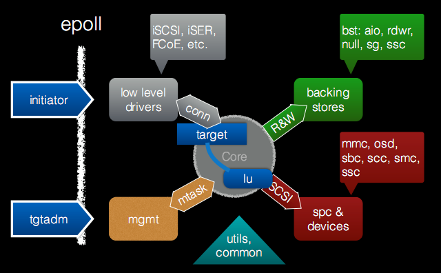
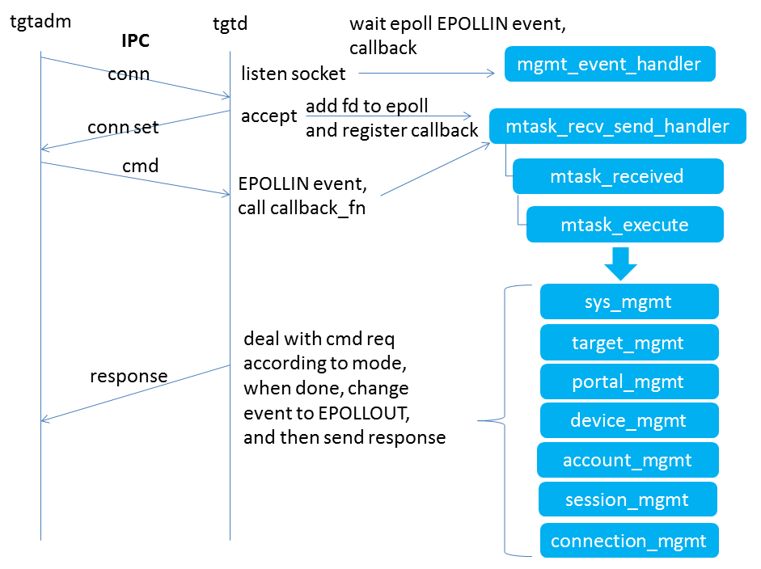
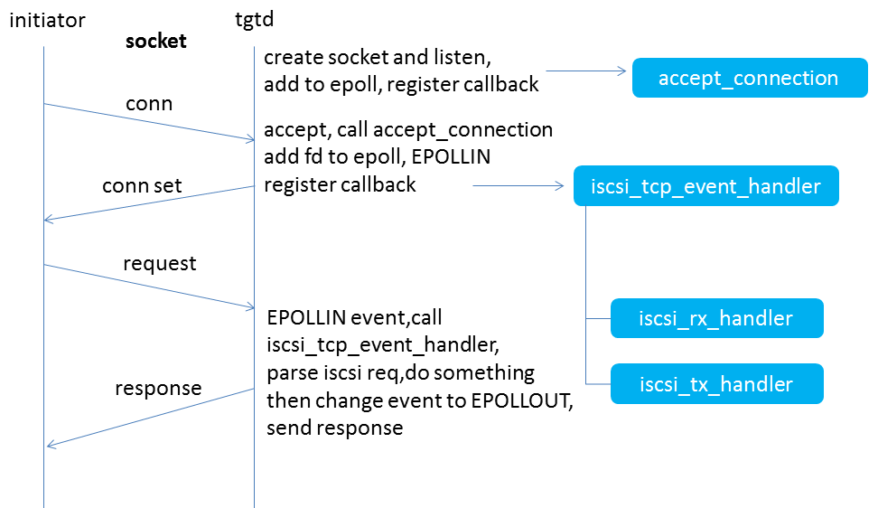
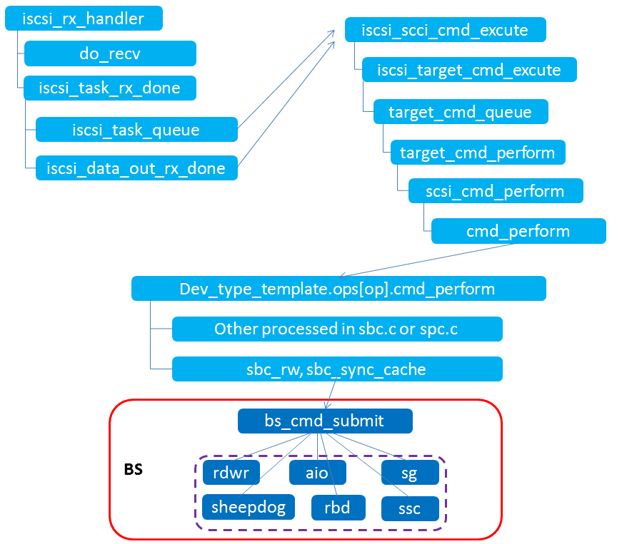
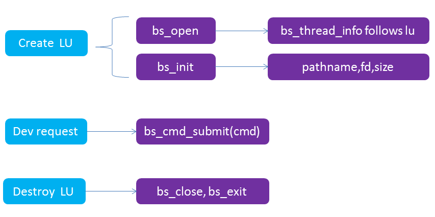
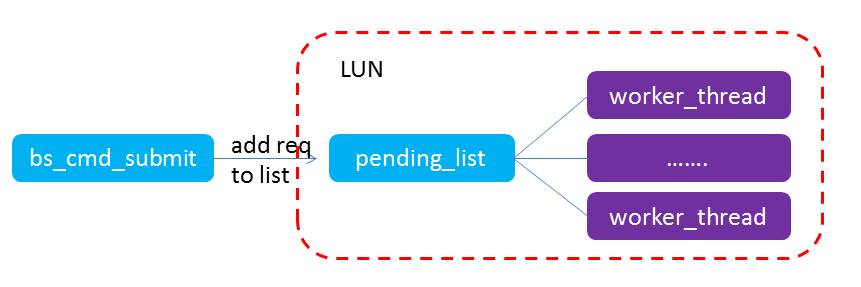

tgt是用户态实现的iscsi target，而iet（iscsi enterprise target）是在内核态实现的target，tgt相比于iet来说，因为其用户态实现，方便调试，新加入一些功能等，不过性能相比iet来说要稍差一点。下面就介绍一下tgt的程序框架（略过iscsi协议解析处理部分），以便于整体把握tgt的代码，方便后续的一些修改。
# 1.整体框架
这里借用tgt官网给出的一张图。

tgt中命令的操作，与initiator端的通信都是通过epoll来实现的，下面分别对这两部分进行说明。
<!--more-->
## 1.1 tgtadm与tgtd的交互
在启动tgtd进程的时候，就会初始化一个unix socket，将该fd加到epoll中，监听EPOLLIN事件，后续每执行一条tgtadm命令，就会使用这个unix socket来和tgtd通信。

如图所示，当在命令行里敲一条tgtadm命令时，通过unix socket发起请求，就会触发epoll 的EPOLLIN事件，tgtd端accept，将连接fd加到epoll中，并注册回调函数mtask_recv_send_handler，返回连接建立的响应给tgtadm端，然后tgtadm命令触发EPOLLIN事件，tgtd端调用mtask_recv_send_handler，根据不同的mode调用不同的处理函数进行处理（这里有sys_mgmt/target_mgmt/portal_mgmt等），处理完后，将事件改为EPOLLIN|EPOLLOUT，然后发送响应给tgtadm端。
## 1.2 initiator与tgtd的交互
tgtd进程在启动的时候就会创建一个socket，用于监听initiator的请求（具体是iscsi_tcp_init_portal函数中的处理），将该socket加到epoll中，注册回调函数accept_connection。
initiator端的请求到来时，将新连接的fd加到epoll中，并注册回调函数iscsi_tcp_event_handler，然后当收到EPOLLIN事件时，会调用iscsi_rx_handler进行iscsi请求的一些解析处理操作，并调用backing store的接口进行io的操作，操作完成后，修改事件为EPOLLLOUT，就会触发调用到iscsi_tx_handler来发送响应给initiator。

## 1.3 函数调用栈
下面给出了iscsi_rx_handler的一些函数调用栈关系，其中涉及到与backing store中io处理接口的调用关系。给出下图作为参考。

# 2. backing store
tgt支持多种后端存储，比如rdwr，aio，sg，rbd，sheepdog等，默认的是rdwr，可以指定flag（O_SYNC|O_DIRECT）。了解清楚tgt的后端存储的处理模式，就可以添加新的后端存储用于支持自定义的功能。

其中主要的接口就是bs_open,bs_init,bs_cmd_submit,bs_close,bs_exit。
bs_open和bs_init就是做创建lun时的一些初始化操作，比如打开设备文件，创建处理现线程，注册处理回调函数等。
bs_cmd_submit：io请求到来时就会调用该函数进行处理。
bs_close和bs_exit就是删除lun的时候做一些销毁操作。
BS中支持同步和异步io两种模式（rdwr就是同步的，aio就是异步的），下面分别介绍这两种模式。
## 2.1 同步io

在同步io中，每个lun都会对应一个请求队列（pending_list），在bs_init时就会创建多个线程（目前新版本一个lun默认16个线程）。新请求到来时，调用bs_cmd_submit将请求添加到pending_list中，多个线程共享这个pending_list，分别从pending_list中取请求来进行处理。当没有请求时，这些线程就会等待在pending_list上，有新请求加入到pending_lsit后，就会唤醒等待的线程来进行处理。
## 2.2 异步io（aio）
tgt使用的是linux native aio来实现的，使用eventfd创建的fd将aio上下文和epoll联系起来。（具体可以参考aio与epoll结合起来如何使用的一些资料）。下面是一些具体的处理逻辑。
1）bs_aio_open：io_setup建立异步io上下文 ，然后afd=eventfd() ，将afd加到epoll中(回调函数bs_aio_get_completions) ，并且afd与aio的上下文关联。
2）bs_aio_cmd_submit：IO到来时调用，先把请求加到cmd_wait_list中，然后遍历list，确定此次能提交的io数并初始化iocb（因为限制了aio的最大处理个数为128，有些io还在处理中，当前提交的aio个数就有限），然后使用io_submit提交一批异步io。
3）IO处理完后，会通过afd触发EPOLLIN事件，调用回调函数bs_aio_get_completions进行处理，先read出当前完成的io数，然后调用
io_getevents()获取出已完成io的信息，然后对每个完成的io调用bs_aio_comlete_one做一些结束的处理（修改处理状态），在这个函数中调用target_cmd_io_done，在target_cmd_io_done中会修改epoll的事件为EPOLLIN|EPOLLOUT，这样就会触发了EPOLLOUT事件，调用iscsi_tcp_event_handler，在这个函数里判断如果是EPOLLOUT，就会调用iscsi_tx_handler来发送响应。
# 3.参考资料
http://stgt.sourceforge.net/
http://www.lenky.info/archives/2013/01/2183